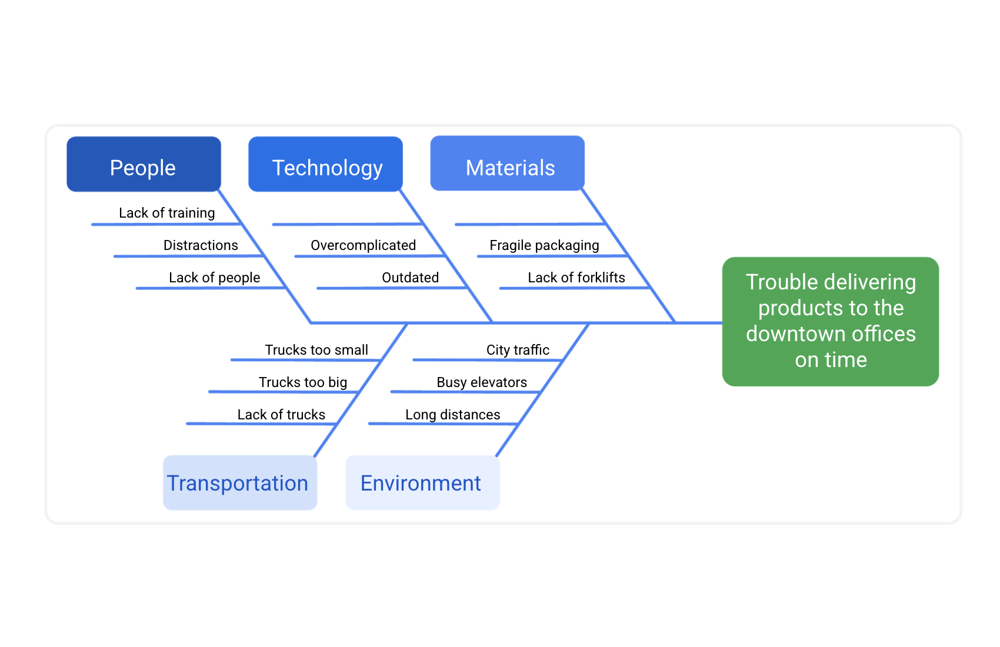
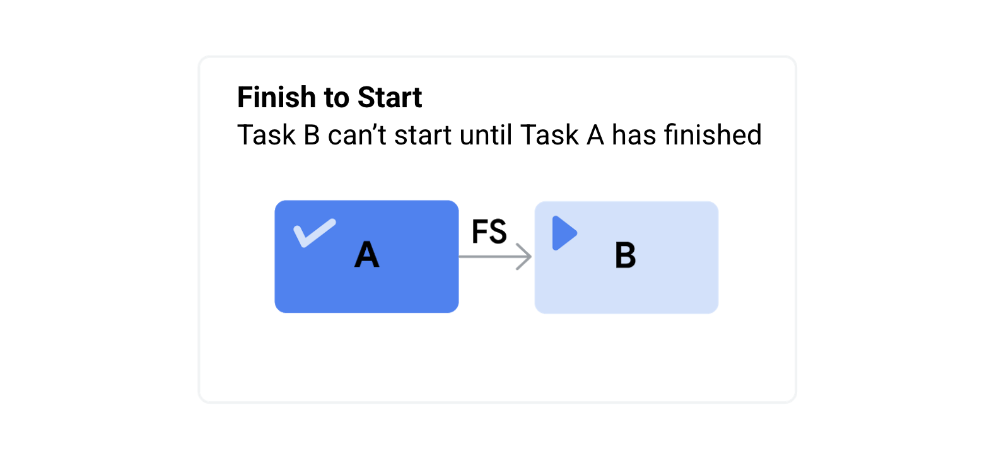
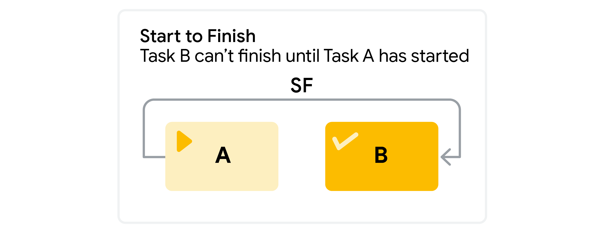

## Project Planning 

### Week1
* [Tips for leading a successful kick-off meeting](#w1r1)
* [Setting milestones: Best practices](#w1r2)
* [Work Breakdown Structure](#w1r3)

### Week2 
* [Case Study : Run fast pay later](#w2r1)
* [Overcoming the Planning Fallacy](#w2r2)
* [Creating Critical Path](#w2r3)
* [Create a Project Plan Tools and Templates](#w2r4)
* [Introduction to Kanban Boards](#w2r5)

### Week3 - Budget  and procurement
* [Project Budgeting 101](#w3r1)
* [Overcoming Budgeting Challenges](#w3r2)
* [Budgeting Terms](#w3r3)
* [Tips for Procurement Process](#w3r4)
* [Avoiding Ethical traps in Procurement](#w3r5)

### Week4 - Risk Management
* [Phases of Risk Management](#w4r1)
* [Uncover Opportunities uinsg Risk Management](#w4r2)
* [How to create a fishbone diagram](#w4r3)
* [Managing Singgle Point of Failures](#w4r4)
* [Visualizing Dependency relationships](#w4r5)

### Week5 - Communication & Documentation

* [Tips for Effective communication](#w5r1)
* [Best practices for building a communication plan](#w5r2)
* [Tailoring a resume for Project Management](#w5r3)
* [OKR - Objectives and Key Results](#w5r4)

[Back - to Specialization topics](./../README.md)

# Tips for leading a successful kick-off meeting 
In the previous video, you learned what a project __kick-off meeting__ is and what it involves. As a reminder, a kick-off meeting is the first meeting among the project team, stakeholders, and the project sponsor at the start of a new project or new project phase. The purpose of a kick-off meeting is to ground everyone in a shared vision, ensure they understand the project’s goals and scope, and make sure that they are all on the same page about their roles and responsibilities on the project. The kick-off meeting is critical to a project’s overall success. It gets the team together to align on goals and visions for the project and sets the project up for success.

This reading will provide you with some tips for running an effective kick-off meeting. 

## Kick-off meeting best practices
* __Set the right time.__ Choose a meeting time that works for everyone. Be mindful of time zone differences. 

* __Set the right length.__ Choose an appropriate meeting length—no more than one hour. You don’t want to waste people’s time, but you also don’t want to run out of time. Kick-off meetings work best when you first share key information and then spend any additional time on questions and team building.

* __Invite the right people.__ Be strategic about including the appropriate people. The goal is to invite attendees who play a role in the development and execution of the project, such as all team members, stakeholders, and the project sponsor. You don’t want to leave anyone out, but you also don’t want to invite people who shouldn’t be there.

* __Designate a notetaker.__ The discussion that takes place during the meeting is important. It is critical that you document any feedback, changes, or questions asked by attendees. If you are leading the meeting, designate someone else to take notes before the meeting starts. You can also use tools like Chorus Notetaker, Google Keep, Google Docs, or Microsoft OneNote.  

* __Set the agenda.__ To recap what we discussed in the video, a kick-off meeting agenda should generally include: introductions, the project background and purpose, project goals and scope, roles and responsibilities, the collaboration process and project tools, what comes next (expectations and action items), and time for questions and discussion.

* __Share the agenda.__ Prior to the meeting, share the agenda with attendees via email and identify speakers for each topic. By sending the agenda in advance, everyone will have an idea of what to expect, time to prepare for anything they may need to present or discuss, and time to generate questions or ideas.

* __Stick to the agenda.__ During meetings, discussions can sometimes go off topic or take longer than expected. As a project manager, it is your job to keep the meeting on track by redirecting discussions to the items on the agenda. 

* __Follow up after the meeting.__ After the meeting, make sure to send out a meeting summary featuring the meeting notes and any action items. 

[Back to Project Planning contents](#c3)

# Setting milestones: Best practices 
You have learned what milestones and tasks are and when, where, and how you will use them as a project manager. In this reading, we will explore best practices for setting milestones. But first, let’s revisit the definitions of tasks and milestones. 

* __A project task__ is an activity that needs to be accomplished within a set period of time and is assigned to one or more individuals for completion. The work of a project is broken down into many different project tasks. 

* __A project milestone__ is an important point within the project schedule that usually signifies the completion of a major deliverable. Milestones are significant checkpoints in your project, and keeping track of them helps ensure that your project is on schedule to meet its goals.

_Image of mountain peaks -- with tasks on top of smaller peaks leading up to milestones on top of larger peaks._

## Set tasks to identify milestones
Setting tasks can help you clearly define milestones. You can do this in two ways:

* __Top-down scheduling:__ In this approach, the project manager lays out the higher-level milestones, then works to break down the effort into project tasks. The project manager works with their team to ensure that all tasks are captured.

* __Bottom-up scheduling:__ In this approach, the project manager looks at all of the individual tasks that need to be completed and then rolls those tasks into manageable chunks that lead to a milestone. 

Most projects have many tasks that lead to milestones. For instance, if your milestone is to receive approval on the first draft of an article that you are writing, you might complete tasks such as “develop outline,” “write first draft,” and “send to the editor.” Then, you may have another set of tasks to achieve before reaching the milestone of revising the article. Milestones serve as check-in points along your project to make sure that you are headed in the right direction toward the end goal. Milestones also make projects more manageable.

## Integrate milestones into your project schedule
There is not a consistent number of milestones in every project. Some projects will have a few milestones, while others may have dozens. Rather than aiming to hit a certain number of milestones, try to set milestones for the most important events in your project. Review your project schedule and identify important moments or checkpoints. In other words, pinpoint where in your project you will achieve major goals and make those points your milestones. 

## Milestone-setting pitfalls
Here are some things to avoid when setting milestones: 

* __Don’t set too many milestones.__ When there are too many milestones, their importance is downplayed. And, if milestones are too small or too specific, you may end up with too many, making the project look much bigger than it really is to your team and stakeholders.  

* __Don’t mistake tasks for milestones.__ Remember that milestones should represent moments in time, and in order to map out how you will get to those moments, you need to assign smaller tasks to each milestone.

* __Don’t list your milestones and tasks separately.__ Make sure that tasks and milestones can be visualized together in one place, such as a project plan. This will help ensure that you are hitting your deadlines and milestones. 

## Key takeaways
Your approach to setting milestones may differ from project to project, but most projects will have at least one milestone and several smaller tasks associated with each milestone. Setting clearly-defined, distinct tasks, and milestones, integrating them into your project schedule, and using a tool that visualizes them together will help organize your project and drive it forward.

[Back to Project Planning contents](#c3)

# Breaking down the work breakdown structure 
In the previous video, you were introduced to a major component of the planning phase: the creation of a __work breakdown structure (WBS).__ A WBS is a deliverable-oriented breakdown of a project into smaller components. It’s a tool that sorts the milestones and tasks of a project into a hierarchy, in the order they need to be completed. 

A thorough WBS gives you a visual representation of a project and the tasks required to deliver each milestone. It makes it easier to understand all of the essential project tasks, such as estimating costs, developing a schedule, assigning roles and responsibilities, and tracking progress. Think of each piece of information as part of the overall project puzzle—you can’t successfully navigate through the tasks without understanding how they all fit together. For instance, many smaller tasks may ladder up to a larger task or milestone.

__A WBS chart with the project title at the top, followed by milestones and then tasks below the milestones_

## Steps to build a WBS
As a reminder, here are three main steps to follow when creating a WBS: 

* __Start with the high-level, overarching project picture.__ Brainstorm with your team to list the major deliverables and milestones. Example: Imagine you are planning a company event. Your major milestones might include categories like “secure venue,”  “finalize guest logistics,” and “establish agenda.”

* __Identify the tasks that need to be performed in order to meet those milestones.__ Example: You could break a milestone like “secure venue” down into tasks like “research venues,” “tour and decorate space,” “make down payment,” and so on. 

* __Examine those tasks and break them down further into sub-tasks.__ Example: You could break down a task like “tour and decorate space” further into sub-tasks like “organize decorating committee,” “purchase decorations,” “assign decorating responsibilities,” and so on. 

## Further reading
For further learning on best practices for developing a WBS, check out this article:

[How to Create a Work Breakdown Structure and Why You Should](https://www.lucidchart.com/blog/how-to-create-a-work-breakdown-structure-and-why-you-should)
## Case study: Run fast, pay later
__Time estimation__ is used to predict the amount of time that will be required to complete a task. We have talked about how a central part of being a project manager involves planning. Carefully performing key steps of your planning process, such as time estimation, can have a big impact on the success of your project. Conversely, flawed time estimation is the root cause of many failed projects. That means many projects fail because project managers and teams fail to accurately estimate the time that it will take to complete tasks. 

Let’s discuss the following case study, which discusses how inaccurate time estimation can affect a project.

### __Run fast, pay later: A case study on time estimation__  

 
Kendra just scored a project manager role on a new project. It was a highly competitive bid, and the company and Kendra are eager to do a great job.

Kendra realized immediately that the timeline for the project would be almost impossible to execute. However, this was the first big project she was asked to manage. Therefore, instead of letting management know about the project’s impossible timeline, Kendra kept quiet and was determined to make it work. She rushed through the planning phase to get the team moving since time was ticking towards the project completion date. Kendra created all of the planning documents without input from her team or other stakeholders, with the sole intention of reaching the deadline.

During the team meeting, Kendra presented her project plan to the team. Right away, team members expressed their concerns with the timeline. They felt like there wasn’t enough time to complete their work, and they worried that the timeline didn’t incorporate enough time for reviews. Kendra documented the team’s concerns, but instructed them to simply work faster and make it happen.

As the project went on, the project faced schedule delays and other issues due to rework, previously unaccounted for tasks, stressed team members, and concerned stakeholders. Ultimately, the project missed its deadline. Later, the company did a retrospective to determine where things went wrong, and Kendra learned a lot of important lessons.

### __Analysis of the case study__  
Let’s break down the project planning process Kendra took and identify any missteps and corrective actions that would have helped set her team up for success.

* __Escalating concerns__  
Kendra sensed the project timeline was problematic right from the start of the project. Instead of gathering information to support her concerns and sharing it with management, she decided to keep the issue to herself. She moved faster towards the goal instead of slowing down and planning the project thoroughly. 

* __Working carefully__  
If Kendra had taken the time to work carefully through the planning process, she may have been able to build a more realistic project plan to deliver the best product to the customer. She might also have identified potential time-saving activities that could have helped her team meet the project deadline. Thorough and careful planning with her team could have helped Kendra identify problems and solutions in advance, such as:

    * __Elimination of tasks__ It is possible that all of the tasks initially listed didn’t need to be completed. There may have been unnecessary work added in, and the team could have completed the project without it.

    * __Increased team size__ Kendra could have addressed the potential schedule risk by requesting more resources early on in the project rather than trying to execute without the necessary resources.

    * __Streamlining of activities__ There may have been some tasks that could have been done in parallel, or at least not in sequential order. 

* __Gathering input from the team__  
Kendra should have brought together team members, peers, and management to help build and review her project plan, especially given the challenges of meeting the proposed project timeline. Kendra also didn’t take action to address the concerns of the team members who were responsible for completing the tasks within the estimated time.  

In this case study, the project manager faced the repercussions of careless time estimates that resulted in rework and unplanned work. Most times, you can take a pain point in a project—like concerns about timelines—and turn it into an opportunity to be flexible and modify the plan to steer the project in a better direction. 

### __Key takeaway__
Be realistic when estimating time and effort for a project. Take the time to carefully evaluate potential risks and the impact on the work, and talk to your team members about these challenges. Don’t be afraid to escalate potential concerns to management. Optimism is a trait of a great project manager and leader, but it can adversely affect your projects when it comes to time estimation.# Overcoming the planning fallacy
It is human nature to underestimate the amount of time and effort it takes to complete a task—from anything as simple as walking the dog to something as complex as completing a project. People generally want to remain hopeful about a positive outcome, and this is a great quality to have as a person. But as a project manager, this kind of optimism can also be a deficiency, especially during the planning phase of a project. Let’s examine a theory known as the __planning fallacy__ to better understand how to set yourself up for success in the planning phase. 

# The planning fallacy and optimism bias 
The idea of the planning fallacy was first introduced in a 1977 paper written by Daniel Kahneman and Amos Tversky, two foundational figures in the field of behavioral economics. The planning fallacy describes our tendency to underestimate the amount of time it will take to complete a task, as well as the costs and risks associated with that task, due to __optimism bias__. Optimism bias is when a person believes that they are less likely to experience a negative event. For example, when you are planning to walk your dog in between meetings, you might think that you can do it faster than you actually can. Optimism bias is what tells you that you are going to be able to walk your dog without being late for your next meeting. If you don’t consider things that might affect the time it will take you to walk your dog—the weather, the chance of them running into another dog and wanting to play, or the fact that they frequently get distracted while sniffing around—you might be late for your next meeting, or you might miss it altogether! 

The planning fallacy can happen to anyone, regardless of whether or not they have experience completing similar tasks. Whether this is your first time walking your dog or your hundredth, you still have to consider the different factors that can affect how long it will take you to complete the walk. This same principle applies in project management. You may be brand new to this kind of project or you may have managed tons of similar projects before; either way, you still need to be careful not to underestimate the time it will take to complete each task on this particular project. As a project manager, you should aim to balance being aware of the planning fallacy with keeping an optimistic attitude about the project, even as things change. Be optimistically realistic: Push for the best outcomes while planning for the proper time it may take to accomplish each task.

## Avoiding the planning fallacy: A case study
Think about the planning fallacy in relation to yourself as a project manager. If you have planned massive efforts in your project plan with an optimism bias, this planning fallacy could have a major impact on your project execution. You could set your team up for failure by not giving them enough time to complete their tasks, causing work to have to be redone or missing opportunities to execute the project more efficiently.

Let’s examine how this happens. David is a project manager responsible for a home construction project. Let’s check out his Work Breakdown Structure (WBS): 

Working through his plan, David knows that certain things need to happen for the house to be completed. He has to order materials, the materials have to be delivered, the contractor has to actually build the house, and there needs to be time for completing finishing touches and adjustments. The time estimations for those major tasks might break down like this:

| Task | Estimated Duration |
|:--|:--|
| Foundation | 2 weeks |
| Construction | 4 weeks |
| Adjustments | 4 weeks|

After creating a WBS and a time estimation chart, David estimates that the construction project will take a total of ten weeks. This sounds perfect because it meets his delivery requirement. If David is unaware of the planning fallacy, he may think his plan is solid and that his team is on their way to building the house within the target timeline!

Fortunately, David is mindful of the planning fallacy. He examines the time estimates more carefully. He considers risks like weather delays or crew members calling out sick, which could set the project’s completion date back. He meets with his team members and other stakeholders to help him uncover other possible risks that could affect the project timeline. After carefully gathering information, he adjusts the time estimates, adding __task buffers__ to some of the project tasks to account for the potential risks.

## Key takeaways
Being on the lookout for __“what-ifs”__ is a key project management skill. Considering situations that could affect whether or not the project is completed on time can help you overcome the planning fallacy. Also, you will always have a project team in your corner, so make sure you use them as resources to help uncover possible risks. Remember to be “optimistically realistic” and push for the best outcome while still planning for the proper time to accomplish each task.

[Back to Project Planning contents](#c3)

# Creating a critical path 
As you’ve just learned, the critical path refers to the list of required project milestones you must reach to complete the project schedule, as well as the mandatory tasks that contribute to the completion of each milestone. You can think of the critical path as a framework that tells you, the project manager, where you are, where you are headed, and when you will get there. 

## Why the critical path is critical
The critical path helps you determine the essential tasks that need to be completed on your project to meet your end goal and how long each task will take. The critical path also provides a quick reference for critical tasks by revealing which tasks will impact your project completion date negatively if their scheduled finish dates are late or missed. A critical path can help you define the resources you need, your project baselines, and any flexibility you have in the schedule. 

## How to create a critical path
Each project you work on will be different, but there are some general steps for creating a critical path that are applicable to most projects.

### Step 1: Capture all tasks 
When you first start working on your project schedule, you will capture all of the tasks associated with the completion of the effort. Remember to use the key planning documents you have created to get you to this point, such as your work breakdown structure (WBS). The main goal in this step is to make sure that you aren’t missing a key piece of work that is required to complete your project. When creating a critical path, focus on the essential, “need to do” tasks, rather than the “nice to do” tasks that aren’t essential for the completion of the project. Here is an example of critical tasks for building the structure of a house:  

| Task                                                 |
| ---------------------------------------------------- |
| A) Excavation                                        |
| B) Foundation                                        |
| C) Framing                                           |
| D) Roof                                              |
| E) Plumbing                                          |
| F) Heating, ventilation, and air conditioning (HVAC) |
| G) Electrical                                        |
| H) Insulation                                        |
| I) Drywall + Paint                                   |
| J) Flooring                                          |

### Step 2: Set dependencies 
Now that you have captured all of your critical tasks in list form, arrange those tasks in order of completion by identifying __dependencies__. To determine dependencies, figure out which tasks must be completed before other tasks can start. For example, you can’t paint the outside of a house before the house is built, so the task of framing the walls must come before the task of painting them. Identifying dependencies is key to a successful project schedule. 

To figure out dependencies for each task, ask:

* Which task needs to take place before this task?

* Which task can be finished at the same time as this task?

* Which task needs to happen right after this task?

Once you have answered these questions, you can list these dependencies next to your list of tasks:  

| Task               | Dependency                          |
| ------------------ | ----------------------------------- |
| A) Excavation      |
| B) Foundation      | A) Excavation                       |
| C) Framing         | B) Foundation                       |
| D) Roof            | C) Framing                          |
| E) Plumbing        | C) Framing                          |
| F) HVAC            | C) Framing                          |
| G) Electrical      | C) Framing                          |
| H) Insulation      | E) Plumbing, F) HVAC, G) Electrical |
| I) Drywall + Paint | H) Insulation                       |
| J) Flooring        | I) Drywall + Paint                  |

### Step 3: Create a network diagram
One common way to visualize the critical path is by creating a network diagram. Network diagrams, like the example below, sequence tasks in the order in which they need to be completed, based on their dependencies. These diagrams help visualize:
* The path of the work from the start of the project (excavation) to the end of the project (flooring)

* Which tasks can be performed in parallel (e.g., HVAC and plumbing) and in sequence (e.g., plumbing then insulation)

* Which non-essential tasks are NOT on the critical path

### Step 4: Make time estimates
After determining tasks and dependencies, consult key stakeholders to get accurate time estimates for each task. This is a crucial step in determining your critical path. If your time estimates are significantly off, it may cause the length of your critical path to change. Time estimates can be reviewed and updated throughout the project, as necessary. 
| Task               | Duration | Dependency                          |
| ------------------ | -------- | ----------------------------------- |
| A) Excavation      | 1 Day    |
| B) Foundation      | 3 Days   | A) Excavation                       |
| C) Framing         | 15 Days  | B) Foundation                       |
| D) Roof            | 3 Days   | C) Framing                          |
| E) Plumbing        | 4 Days   | C) Framing                          |
| F) HVAC            | 3 Days   | C) Framing                          |
| G) Electrical      | 3 Days   | C) Framing                          |
| H) Insulation      | 2 Days   | E) Plumbing, F) HVAC, G) Electrical |
| I) Drywall + Paint | 15 Days  | H) Insulation                       |
| J) Flooring        | 7 Days   | I) Drywall + Paint                  |

### Step 5: Find the critical path 
Now that you have your estimated durations for each task, add that information to your network diagram:

If you add up the durations for all of your “essential” tasks and calculate the longest possible path, you can determine your critical path. In your calculation, only include the tasks that, if they go unfinished, will impact the project’s finish date. In this example, if the “non-essential” tasks—like landscaping and driveway pavement—are not completed, the house structure completion date will not be impacted. 

You can also calculate the critical path using two common approaches: the forward pass and the backward pass. These techniques are useful if you are asked to identify the earliest and latest start dates (the earliest and latest dates on which you can begin working on a task) or the slack (the amount of time that task can be delayed past its earliest start date without delaying the project).

* The __forward pass__ refers to when you start at the beginning of your project task list and add up the duration of the tasks on the critical path to the end of your project. When using this approach, start with the first task you have identified that needs to be completed before anything else can start. 

* The __backward pass__ is the opposite—start with the final task or milestone and move backwards through your schedule to determine the shortest path to completion. When there is a hard deadline, working backwards can help you determine which tasks are actually critical. You may be able to cut some tasks—or complete them later—in order to meet your deadline.  

[Back to Project Planning contents](#c3)

# Creating a project plan: Tools and templates
__Project plans__ are critical because they are used to capture the scope and time it takes to complete a project. The project plan is essentially the project’s blueprint—it lays out all of the activities and milestones that your team needs to achieve in order to successfully complete the project. Project plans come in various shapes, sizes, and forms. Depending on the project you are managing, the template you use may vary, and some companies even have standard templates they require their project managers to use. 

In the previous videos, you learned about various tools and techniques to create a project plan. But how do you know which tools and techniques to use and when? As a general rule, it is best to use a spreadsheet for a simple project and project management software for a more complex project. Regardless of what tool you use, be sure to include this key information: 

* __Task ID numbers__ or task names: You might end up with dozens, hundreds, or even thousands of tasks in a project. Assigning a task ID or name makes it easy to find and reference a task when communicating with team members and stakeholders. 

* __Task durations:__ A task duration is the amount of time you estimate that task should take. Adding task durations to your project plan helps you organize and prioritize the tasks in the project to help ensure you hit your goal on time. 

* __Start and finish dates:__ Including start and finish dates for each task helps you track whether you are progressing on time or not. 

* __Who is responsible for what:__ Including each team member’s role and responsibilities helps promote clarity and efficiency. As a best practice, assign an owner to each task, as well.

## Using a spreadsheet to build a project plan
Spreadsheets are an excellent tool to use for project plans, particularly for projects that are less complex and that have a clear assignment of tasks. Spreadsheets can require a lot of manual input of information, but as a project manager, you may find that you like the control that spreadsheets provide. Spreadsheets are also customizable, so you can tailor them to your project’s needs. 

The graphic below shows what a project plan for a website launch might look like in a simple spreadsheet.

__Pro tip:__ It is important to incorporate your __Work Breakdown Structure (WBS)__ numbers into your project plan. In this example, the ID numbers directly relate to the WBS numbers, which is a helpful way to maintain consistency. 

### Spreadsheet templates
It is helpful to try online tutorials so that you can get used to the different functionalities and user interfaces of each tool. We have included links to some project plan templates below:

Smartsheet: Project Plan Templates for Microsoft Word

Smartsheet: Project Plan Templates for Google Sheets

Google Project Plan Timeline Template

Microsoft Gantt Chart Template

### Work management tools
There are many work management tool options available for you to utilize when planning your project. We covered some of these in previous videos, but as a refresher, it is important to keep in mind that every company, project manager, and customer has a work management tool preference. You may come across tools like Smartsheet, Asana, Jira, Trello, and many more. These tools allow for collaboration and communication at a task level. 

### Key takeaway
The tool you use to create your project plan should help you collect and track project details, manage your schedule, and visualize how your project is progressing. A clear, thorough, and organized project plan can help create the recipe for project management success.

[Back to Project Planning contents](#c3)

# Introduction to Kanban boards 
__Kanban boards__ are a visual tool used to manage tasks and workflows. Kanban boards can be created on whiteboards, magnetic boards, poster boards, computer programs, and more. Tasks associated with the project are written on cards. These cards are placed in columns, which represent the progress made. 

Although Kanban boards are useful for all kinds of projects, they are typically most suitable for project teams working in an Agile project management approach. You may remember that Agile project management is an iterative approach to managing projects that focuses on continuous releases and incorporates customer feedback with every iteration. Once you become a project manager and have created your project plan, you can decide whether a Kanban board is right for your project. 

## Purposes of a Kanban board
Kanban boards are used to:

* Give a quick visual understanding of work details and provide critical task information.

* Facilitate handoffs between stakeholders, such as between development and testing resources or between team members who work on related tasks.

* Help with capturing metrics and improving workflows.

## Using a Kanban board
Before creating a board, it is best practice to gather the necessary information and lay out key elements, such as tasks, status, dates, and durations. That information is useful when building your board. 

Let’s turn our focus to an example of a Kanban board below. Each colored rectangle is associated with a task. The tasks are represented horizontally across the effort timeline. Each column represents where the task is in relation to its completion. So as a task is started, it will move from to do, to in progress. When the project is almost ready to be released or complete, it will move to testing, and when it is tested and approved, it will move to done. Note that this is just one example of a Kanban board, and depending on the tool you use—such as software or a physical board—you can customize your board using various columns and cards. The board can also have rows for resources (team or person), to help visualize who is actively working on what.

## Creating cards
Cards will vary in style—you can even use sticky notes on a whiteboard—but most cards will contain a few key details about the task that they represent. When using physical cards, teams often use both sides. Here is what both sides of the card should include:

__Front__  
* __Title and unique identifier:__ Make sure you have a quick reference for tasks and ID numbers.

* __Description of work:__ Briefly describe the task to be accomplished. Remember that this is intended to be captured on something no larger than an index card.

* __Estimation of effort:__ Estimate the amount of work it will take to complete the task. For example, you can write “small,” “medium,” or “large” to indicate the level of effort you think that task will involve. 

* __Who is assigned to the task:__ Indicate who is responsible for completing the task; ideally, one person per card.

__Back__   
* __Start date:__ Include the start date of the task for use in metrics, tracking, and ensuring that your time estimate is accurate.

* __Blocked days:__ Indicate which days your task may be halted. A task can become blocked if it can’t continue to be worked on. For example, if you were supposed to receive a deliverable and it hasn’t been delivered yet, then your day may be blocked for this particular task.

* __Finish date:__ As with any plan, it is important to track when the task is supposed to be finished. This allows you to ensure that your project is still on track to reach the end goal.

## Kanban board software
If you opt to use a software tool rather than a physical board, you have a few options. Asana and Trello are both great software tools to use if you are looking to introduce Kanban to your project. There are many options, so take the time to evaluate which is best for you and your project.

[Back to Project Planning contents](#c3)

# Project budgeting 101 
A project budget is the estimated monetary resources needed to achieve a project's goals and objectives. In previous lessons, we covered a wide range of information related to project budgets. Let’s recap to make sure you have the information and tools you need to create and manage your project’s budget.

Budgets are typically created in the __initiation__ and __planning phases__ of your project. As with any other project management document, you need to continue to review and control the budget throughout the life cycle of your project. Your budget is more than just how much it will cost to complete the project—it is a helpful tool to reference when communicating with stakeholders and can double as a tracker for your project’s progress. Budgets also help control your costs and act as the baseline for the financial portion of the project. 

## Project budgeting best practices
Here are a few tips to consider when creating your project budget:

* __Reference historical data:__ Your project may be similar to a previous project your organization has worked on. It is important to review how that project’s budget was handled, find out what went well, and learn from any previous mistakes.

* __Utilize your team, mentors, or manager:__ Get into the habit of asking for your team to double check your work to give you additional sets of eyes on your documents.

* __Time-phase your budget:__ Time-phased budgeting allows you to allocate costs for project tasks over the projected timeline in which those expenses are planned to take place. By looking at your tasks against a timeline, you can track and compare planned versus actual costs over time and manage changes to your budget as necessary.

* __Check, check, and double check:__ Make sure that your budget is accurate and error-free. Your budget will likely require approval from another department, such as finance or senior management, so do your best to ensure that it is as straightforward to understand as possible and that all of your calculations are correct.

##  Categorize different types of costs
There are different types of costs that your project will incur. For example, you may need to account for both direct costs and indirect costs in your project budget. Categorize these different types of costs in your budget so that you can ensure you are meeting the requirements of your organization and customer. 

### Direct costs
These are costs for items that are necessary in order to complete your project. These costs can include:

* Wages and salaries of employees and contractors 
* Materials costs
* Equipment rental costs
* Software licenses 
* Project-related travel and transportation costs

Staff training

### Indirect costs
These are costs for items which do not directly lead to the completion of your project but are still essential for the project team to do their work. They are also referred to as overhead costs. These costs can include:

* Administrative costs
* Utilities
* Insurance 
* General office equipment 
* Security

## Develop a baseline budget
A __baseline budget__ is an estimate of project costs that you start with at the beginning of your project. Once you have created a budget for your project and gotten it approved, you should publish this baseline and use it to compare against actual performance progress. This will give you insight into how your project budget is doing and allow you to make informed adjustments.

It is important to continually monitor your project budget and make changes if necessary. Be aware that budget updates can require the same approvals as your initial budget. Also, you should “re-baseline” your budget if you make significant changes. Re-baselining refers to when you update or modify a project's baseline as a result of any approved change to the schedule, cost, or deliverable content. For example, if you have a significant change in your project scope, your budget will likely be impacted. In this instance, you would need to re-baseline in order to adhere to a realistic budget.

## Perform a reserve analysis
A reserve analysis will help you account for any buffer funds you may need. First, review all potential risks to your project and determine if you need to add buffer funds, also referred to as a contingency budget. These funds are necessary because new costs that you did not expect are likely to happen throughout the project.

You may also want to account for cost of quality in your overall project budget. The cost of quality refers to all of the costs that are incurred to deliver a quality product or service, which can extend beyond material resources. This includes preventing or addressing issues with products, processes, or tasks, & internal and external failure costs. One example would be having to redesign a product or service due to defects. A defect could mean refunds to customers, time and money required to create a new product or service, and multiple other potential costs affecting the client.

## Key takeaways
Budgeting in the project management world is a complex process involving many different parties and documentation, but following the best practices described in this reading can help break it down. Remember to use historical data and time-phasing, and reach out to your team for support. Make sure you are capturing all of the components of your budget, including direct and indirect costs. Finally, be sure to baseline your budget so you know where your money is being used and when. These tips can help set you up for budget management success.

[Back to Project Planning contents](#c3)

# Overcoming budgeting challenges 
As you have learned, effective budgeting can set you up for success as a project manager. This reading will discuss some of the most common budgeting challenges you may encounter as a project manager and how to manage them.

## Challenge 1: Budget pre-allocation
You may encounter situations where your budget is already set before you even start the project. This is known as budget pre-allocation. Some organizations follow strict budgeting cycles, which can lead to cost estimations taking place before the scope of the project is completely defined.  

If you are given a pre-allocated budget, it is important to work with your customer to set expectations on scope and deliverables within the allocated budget. To deliver a great product within your allocated budget will require detailed planning.

A pre-allocated budget should also be routinely monitored to ensure the amounts you have budgeted are sufficient to meet your costs. Be sure to carefully track all expenses in your budget. Regularly match these expenses against your pre-allocated budget to ensure you have sufficient funds for the remainder of your project.

Part of that planning includes making sure that you are tracking fixed and time- and materials-based expenses. __Fixed contracts__ are usually paid for when certain milestones are reached. __Time and materials contracts__ are usually paid for monthly, based on the hours worked and other fees associated with the work, such as travel and meal expenses. 

## Challenge 2: Inaccurately calculating TCO
Another budgeting pitfall you should try to avoid is underestimating the __total cost of ownership (TCO)__ for project resources. TCO takes into account multiple elements that contribute to the cost of an item. It factors in the expenses associated with a product or service over its lifetime, rather than just upfront costs. 

Let’s relate TCO to something more common, like owning a vehicle. Let’s say you buy a vehicle for a certain price, but then you also pay for things related to the vehicle, such as license fees, registration fees, and maintenance. If you add all of this up, you have your TCO for that vehicle. So now that you know what your TCO is, you may consider those fees before you buy your next vehicle. For example, you might opt for a vehicle with fewer maintenance requirements than one that requires more frequent service, since you know that will save you money overall. 

The same concept applies to budgeting on a project. If you have a service requirement for a software technology that your team is using, for example, then it is important to budget for the costs of maintenance for that service. Additional types of costs you may need to account for when calculating TCO include warranties, supplies, required add-on costs, and upgrade costs.

## Challenge 3: Scope creep
Scope creep is when changes, growth, and other factors affect the project’s scope at any point after the project begins. Scope creep causes additional work that wasn’t planned for, so scope creep can also impact your budget. 

There are several factors that can lead to scope creep, such as: 

* A vague Statement of Work (SoW)

* Conversations and agreements about the project that aren’t officially documented

* Unattainable timeframes and deadlines

* Last-minute asks from priority stakeholders

Addressing these factors as you plan your project can help prevent scope creep from impacting your budget.

## Key takeaway
There can be many challenges to face when planning and managing a budget. Budget pre-allocation, underestimating the TCO of project resources, and scope creep are some of the most common. As you continue your career as a project manager, awareness of these challenges can help you avoid and overcome them.

[Back to Project Planning contents](#c3)

# Optional: Introduction to budgeting terms 
Now that you have learned how to create a project budget, let’s discuss some of the common terms you will use when you are estimating, tracking, and maintaining it. 

## Cash flow
Cash flow is the inflow and outflow of cash on your project. As a project manager, this is important to understand because you need __funding__ (cash into your project) to keep your project running. 

Cash that comes into your project allows you to maintain and compensate resources and pay invoices for materials or outside services. In some cases, a project may start out with all of the cash it will receive until the end. If this is the case, it is important to monitor your outflow to ensure that you have enough funding to complete the project.

Monitoring cash flow allows you to have a reference point for your project’s health. For example, if the cash flow coming into your project is lower than your outflow, you will need to adjust your budget. Planning and tracking the cash flow for your project is a key component of budget management.

## CAPEX and OPEX
Organizations have a number of different types of expenses, from the wages they pay their employees to the cost of materials for their products. These expenses can be organized into different categories. Two of the most common are CAPEX (capital expenses) and OPEX (operating expenses).

* __CAPEX (capital expenses)__ are an organization's major, long-term, upfront expenses, such as buildings, equipment, and vehicles. They are generally for assets that the company will own and keep. The company incurs these expenses because they believe they will create a benefit for the company in the future. 

* __OPEX (operating expenses)__ are the short-term expenses that are required for the day-to-day tasks involved in running the company, such as wages, rent, and utilities. They are often recurring.  

You may need to account for both OPEX and CAPEX on your projects. For example, a major software acquisition as part of an IT project could be treated by your organization as a capital expense. The monthly wages paid to a contractor to help deploy the software would be an operating expense. It’s a good idea to talk to your finance or accounting department when you start working on your project budget to see how they determine the difference between OPEX and CAPEX. This will guide you in properly allocating capital and operating expenses for your projects.

## Contingency reserves
Sometimes, a project hits a snag and incurs additional expenses. One way to prepare for unplanned costs is by using contingency reserves. Contingency reserves are funds added to the estimated project cost to cover identified risks. These are also referred to as __buffers.__

To determine the amount of your contingency reserves, you will need to go through the risk management process and identify the risks that are most likely to occur. We will go into more detail on risk management later in the course, but it is important to understand that risks to your project can have an impact on your budget.

Contingency reserves can also be used to cover areas where actual costs turn out to be higher than estimated costs. For example, you may estimate a certain amount for labor costs, but if a contracted worker on your team gets a raise, then the actual costs will be higher than you estimated. 

## Management reserves
While contingency reserves are used to cover the costs of identified risks, management reserves are used to cover the costs of __unidentified risks.__ For example, if you were managing a construction project and a meteor hit your machinery, you could use management reserves to cover the costs of the damage. 

Contingency reserves are an estimated amount, whereas management reserves are generally a percentage of the total cost of the project. To determine a project’s management reserves, you can estimate a percentage of the budget to set aside. This estimate is typically between 5–10%, but the amount is based on the complexity of the project. A project with a more complex scope may require higher management reserves. Note that the project manager will generally need approval from the project sponsor in order to use management reserves.

[Back to Project Planning contents](#c3)

# Tips for the procurement process 
As you have learned, __procurement__ means obtaining all of the materials, services, and supplies required to complete the project. You have just learned about the procurement process in project management. To recap, there are five steps in the typical procurement process:

* __Initiating:__ planning what you need to meet your project goals

* __Selecting:__ deciding which supplies and vendors to use

* __Contract writing:__ developing, reviewing, and signing contracts

* __Controlling:__ making payments and maintaining and ensuring quality

* __Completing:__ measuring your success

_Graphic with the five stages listed: initiating, selecting, contract writing, controlling and completing_

During each step of the procurement process, there are some tips that can help you save time and money while ensuring your project’s success. 

## Tips for initiating 
While planning your project, figure out which materials, resources, and supplies you will need to get the job done. During this step, you will decide which items will be internally procured and which items will be externally outsourced. Once you’ve decided which items you need to outsource, compare each of those items specifications, components, quality measurements, standards, and characteristics with your project’s requirements. You may find that some of the items have features you don’t need. If you can identify those unnecessary features, you will know exactly what you want and don’t want in an item, possibly reducing your total cost. 

## Tips for selecting 
Now that you have outlined what you need for your project, you need to determine vendors to source these items. Research and assess various vendors and suppliers, and try to find out if your preferred vendors have a reputation for delivering quality work on time. After you’ve identified your preferred vendors and suppliers, interview them to learn more about their products and services. If possible, make site visits to see exactly how each vendor runs their business in person. 

## Tips for contract writing
Contract writing requires excellent attention to detail, so pay close attention to the inclusions and exclusions in the vendor’s offer. There may be some items included in the vendor’s price that you can provide in-house at low or no additional cost. For example, the vendor’s offer may include charges for storing materials, using certain equipment, or labor. These are all things that you may be able to provide from your organization’s resources, so you can opt to save costs with the vendor on those items by using in-house materials and resources. 

Sometimes, the vendor may write the contract. In this case, checking carefully for clarity and accuracy ensures that you know exactly what you are getting from the vendor. Whether the contract is written by you or by the vendor, you will almost always want to consult with a legal and compliance team to ensure that everything in the contract is ethical and legal.

## Tips for controlling
The procurement process isn’t over when the contracts are signed. The next step is to ensure that the work is being done according to the terms of the contract. You will need to periodically review the performance and quality of each vendor. When communicating with vendors, remain professional but firm to ensure that all project requirements are being fulfilled and that all major milestones are being met on time and at cost. 

Building and maintaining a good relationship with your vendors benefits the team and the overall project. This relationship will make it easier to make adjustments and contract revisions if the need arises. Taking certain measures, like conducting regular check-in meetings, will ensure that the work is being completed according to plan. 

## Tips for completing
In the completing step of the procurement process, you will measure the success of your procurements. Ask yourself:

* Were the materials created good quality? 

* Were there any issues with labor contracts? 

* How were your relationships with vendors? 

During this step, it is also important to document any lessons learned. It is likely that you will be involved in another project similar to this one in the future. Take notes about how the procurement process went so you can use this information on a future project. 

## Key takeaways
Procurement is an ongoing process that can be repeated during the life cycle of a project. You may initiate the procurement process several times over if you need additional deliverables. To do so, you will likely evaluate your current vendors—or select new ones if necessary. If you change vendors or contract terms, you will have to write new contracts. It is important to periodically review the quality of each vendor during the controlling phase and, once everything is finished, document the lessons you learned during the completion phase. 

[Back to Project Planning contents](#c3)

# Avoiding ethical traps in procurement 
Now that you have learned about the importance of ethics when conducting procurements, let’s talk about some potential ethical traps you might face and how to navigate them. 

## Understanding ethical traps 
An __ethical trap__ is an ethical dilemma that causes us to make a certain decision without regard for our ethical principles. You may face ethical traps throughout the course of a project. However, ethics can be of particular concern when it comes to procurement. As you have learned, project managers must take precautions to ensure that they and their suppliers are following ethical principles during the procurement process. 

## Common ethical traps
Sometimes, potential ethical issues can be overlooked or can be considered the necessary cost of doing business. This is a dangerous line of thinking since these types of assumptions can put your project, company, and career at risk. To review what we discussed in the video, a few of the most common ethical traps that exist when conducting procurements are corruption and bribery, sole-supplier sourcing, and interactions with state-owned agencies.

### Corruption and bribery   
You may be confronted with different types of corruption when going through the procurement process. One form of corruption is when a vendor seeks to reduce the competition for a contract during the bidding process. A company may attempt to bribe members within the organization to sway their decision into a favorable outcome for the vendor. Bribes may include things like money, gifts, tickets to events, and more. Another type of corruption scheme is to offer a certain percentage of an awarded contract—also known as a kickback—to an official who can ensure that their company wins the bid.

### Sole-supplier sourcing   
In some situations, having a vendor who a company is already familiar with smooths the procurement process and works well for both parties. Ethical issues arise when other vendors aren’t even allowed to bid for contracts for which they are similarly qualified. With sole-supplier sourcing, vendors may reach out to buyers before a bid is even requested. When the buyer’s organization decides to work with that vendor based on their previously-established relationship, that limits competition before the bidding has even begun. When this happens, companies and the public miss out on the advantages of competition, such as reasonable pricing, product quality standards, or speedy delivery options. 

### Interactions with state-owned entities
There are some instances in which government agencies require an organization to adhere to stricter ethical standards than they might have otherwise. Most government regulatory agencies exist because a company or an entire industry has ranked profits over their workers or the environment. Governmental agencies such as the Food and Drug Administration and The Occupational Safety and Health Administration, for example, keep businesses within legal and ethical standards. If you are unfamiliar with any governmental restrictions that may affect your industry, organization, or project, you could unintentionally fall into an ethical trap.

## Avoiding ethical traps    
Here are some guidelines that will help you avoid falling into ethical traps when it comes to procurement:

### Understand the legal requirements for your procurements. 
Every country has regulations to adhere to when conducting business in that country. Be sure to research the legal and ethical requirements based on your project and procurement needs, and if your organization has a legal team, make sure to lean on them for support and advice.

### Stick to your ethical codes. 
Honesty, responsibility, respect, and fairness are the values that underpin ethical behavior in the project management profession. The Project Management Institute’s (PMI) code of ethics provides detailed guidelines to help ensure you maintain ethical conduct in your projects. 

## Test your ethics. 
When you face an ethical dilemma, ask yourself questions in each of the following categories:

* __Shame:__ Would you be ashamed if someone knew what you did?

* __Community:__ Would you want your friends to know the decision you made? 

* __Legal:__ Would you face legal action if you took this action? 

* __Situation:__ Would your actions be justified in this situation?

* __Consequence:__ Would a negative outcome be worth your actions? 

## Key takeaway
Making a decision when facing an ethical dilemma can be challenging. But learning the legal requirements for your procurements, sticking to a professional code of ethics, and testing yourself on the ethics of your decision making can help you avoid ethical traps and conduct your procurements honestly, responsibly, and fairly. 

[Back to Project Planning contents](#c3)

# Phases of risk management 
In a previous video, you learned that risk management is the process of identifying and evaluating potential risks and issues that could impact your project. Risk management is an ongoing practice throughout the life cycle of your project. It typically involves some variation of these five steps:

* Identify the risk.
* Analyze the risk.
* Evaluate the risk.
* Treat the risk. 

Monitor and control the risk.

Let’s break these down:

1. __Identify the risk.__ The first phase of the risk management process is to identify and define potential project risks with your team. After all, you can only manage risks if you know what they are. 

2. __Analyze the risk.__ After identifying the risks, determine their likelihood and potential impact to your project. Serious risks with a high probability of occurring pose the greatest threat.

3. __Evaluate the risk.__ Next, use the results of your risk analysis to determine which risks to prioritize.

4. __Treat the risk.__ During this phase, make a plan for how to treat and manage each risk. You might choose to ignore minor risks, but serious risks need detailed mitigation plans.

5. __Monitor and control the risk.__ Finally, assign team members to monitor, track, and mitigate risks if the need arises.

In the upcoming videos and activities, you will learn about each of these phases in more detail and use tools and templates to navigate the risk management process. 

[Back to Project Planning contents](#c3)

 

# Uncover opportunities using risk management 
When you think about risks, it is likely that you automatically think of potential negative events. But when identifying risks, it is important to also consider the good things that could happen, which are considered opportunities. An opportunity is a potential positive outcome of a risk. It is important to recognize opportunities and to capitalize on them as they appear so you can reach your project goals faster, more cheaply, or with less effort. Some examples of opportunities include: 

* Completing a milestone ahead of schedule
* Discounted materials 
* Availability of additional resources (people, investments, equipment) 

## How to recognize an opportunity
An __opportunity__ is a potential positive outcome that may bring additional value to a project. You can use the same tools and techniques that you use in risk management—identify, analyze, evaluate, treat, and control—to add potential opportunities to your risk management plan. You need to know what to do if things go wrong, but you should also make plans to seize opportunities. By using techniques such as brainstorming and drawing on project history or prior experience, you can identify potential opportunities and outline how you will take advantage of them if they occur.

As a project manager, you should always be on the lookout for potential opportunities when developing your risk management plan. Review the following article for further information on using risk management strategies to identify and take advantage of opportunities that may occur during your projects:  [Effective strategies for exploiting opportunities](https://www.pmi.org/learning/library/effective-strategies-exploiting-opportunities-7947)

[Back to Project Planning contents](#c3)

# How to create a fishbone diagram 
Previously, you learned about some tools to help you identify risks. In this reading, we will dive deeper into how to create and use one of those tools: the fishbone diagram.

Fishbone diagrams—also known as __Ishikawa diagrams__ or __cause-and-effect diagrams__—were developed by Japanese organizational theorist Kaoru Ishikawa in the 1960s to measure quality control processes in the shipbuilding industry. Fishbone diagrams are a visual way to look at cause and effect. They are called fishbone diagrams because they have a similar shape to a fish skeleton. 

Fishbone diagrams help the team to brainstorm potential causes of a problem or risk and sort them into useful categories. These categories show the areas that you should focus on to mitigate that risk. Fishbone diagrams are also very helpful in finding the __root cause__ of a problem. A root cause is the initial cause of a situation that introduces a problem or risk. The purpose of using fishbone diagrams in risk management is to identify the root cause of a potential problem for a project or program.  

## Case study: Using a fishbone diagram to identify causes of risks  

Miguel is a project manager at Office Supply Inc. He is in the planning phase for an upcoming summer promotion project, which will include free delivery of products. Unfortunately, in the past, the company has had trouble delivering its products to downtown office buildings on time. Miguel builds a fishbone diagram to see if he can identify some of the possible causes of this problem in order to mitigate this risk on the current project. He follows these steps to build his diagram:

### Step 1) Define the problem 
First, Miguel clearly defines what the problem entails. In this case, Miguel states the problem as “trouble delivering products to downtown office buildings on time.” Then he adds the problem to the head of his fishbone diagram. 

### Step 2) Identify the categories 
In this step, Miguel thinks of the types of categories that could be causing the problem. These categories will change depending on the type of problem or industry. Some common examples of categories include “people,” “technology,” “materials,” “transportation,” “money,” “time,” “environment,” and “procedures.” 

For the delivery problem at Office Supply Inc., Miguel lists the categories “people,” “technology,” “materials,” “transportation,” and “environment” at the top and bottom of the lists to the left of the problem in his fishbone diagram. 

### Step 3) Brainstorm the causes 
Now that Miguel has identified possible categories that relate to the risk, he brainstorms areas of concern within each category. He reaches out to his team for help in identifying these possible causes. Then, Miguel fills in the lists with some of the causes that could be related to each category.

__Pro tip:__ Brainstorming should be a judgment-free zone. Encourage the flow of information related to the categories and try not to rule things out. When dealing with human factors, steer clear of naming individuals; instead, focus solely on behaviors.

### Step 4) Analyze the causes
Now that Miguel has discovered several possible causes for the delivery problems to downtown offices, he analyzes those causes. He needs to identify the root cause of the existing problem so he can figure out how to mitigate it for the current project.

Note that one cause of a problem isn’t necessarily the root cause. For example, Miguel has identified that a lack of forklifts is a problem. Having more forklifts would allow the company to get the products on and off of the trucks more quickly. However, after calculating the amount of time it takes to unload and load the products, Miguel realizes that adding more forklifts won’t significantly reduce the amount of time to get the products from the warehouse to downtown offices. Therefore, this is one cause of the problem, but it is not the root cause.

On the other hand, Miguel has noticed that there is no set schedule for sending out deliveries. Since the problem only exists in the city instead of in the suburban areas, he realizes that traffic must also be playing a role in the late deliveries. Therefore, changing the schedule so that the delivery times are before the city’s rush hour may help fix the problem.    

__Pro tip:__ Fishbone diagrams are tools that can be useful during any phase of the project. When you use them in risk planning, you are trying to identify the possible causes of a problem that may or may not occur. When you use them in the execution phase, you are trying to find the root cause of an issue that has already occurred. 

## Key takeaway
Identifying risks and measuring their potential impact on a project can be a complex task. You can help visualize these issues by creating fishbone diagrams. To recap, the steps to create a fishbone diagram are:

* Define the problem
* Identify the categories
* Brainstorm the causes
* Analyze the causes

Once you’ve developed a fishbone diagram to help find a problem’s root cause and measure its potential impact on the project, you can then move on to determining how to mitigate the risk. 

[Back to Project Planning contents](#c3)

# Managing single point of failure risks 
Previously, you learned how to use various tools and strategies to identify and manage risks as you plan your project. In this reading, we will discuss how to manage risks with the highest potential of impacting your project.

## Single point of failure risks
Once you have identified your risks and ranked them, give special attention to the risks that could have a catastrophic effect on your team’s ability to complete the project. __A single point of failure__ is a risk that, if it were to materialize, could cause a significant amount of disruption to your project and could even shut it down. You should plan for these risks early on in the project. 

For example, a lot of projects use __subject matter experts (SMEs)__—team members with a deep understanding of a particular job, process, department, function, technology, machine, material, or type of equipment. SMEs are involved to advise you throughout the project life cycle. Having only one SME familiar with a critical system on your team is an example of a single point of failure risk. This SME will only offer one perspective, and if they are the only person advising on the system, there is no one to offer another perspective. 

## Case study: Using mitigation strategies to manage single point of failure risks
Let’s imagine that Office Green uses plant seeds from a company in South America for the majority of its offerings. The plants produced by these seeds are in high demand by Office Green’s customers. However, the local government on the suppliers’ end just announced that it would be imposing a new tax on the exporting of seeds and produce. As a result, the price of the seeds suddenly becomes so high that it is difficult for the company to supply the seeds to Office Green, putting the project at risk of not having these seeds available to purchase.

Let’s look at how these four risk mitigation strategies can be used for managing single point of failure risks in the Office Green example:

### Avoid  
This strategy seeks to sidestep—or avoid—the situation as a whole. In the Office Green example, the team could avoid this risk entirely by considering using another seed that is widely available in several locations.

### Minimize  
Mitigating a risk involves trying to minimize the catastrophic effects that it could have on the project. The key to minimizing risk starts with realizing that the risk exists. That is why you will usually hear mitigation strategies referred to as workarounds. What if the Office Green team decided to use both the original South American supplier and another supplier from a neighboring country? More than likely, the change in taxation and regulation wouldn’t affect both companies, and this would provide Office Green some flexibility without having to completely eliminate their preferred supplier.

### Transfer 
The strategy of transferring shifts the responsibility of handling the risk to someone else. The Office Green team could find a supplier in North America that uses the seeds from several other South American countries and purchase the seeds from them instead. This transfers the ownership of South American regulatory risks and costs to that supplier.

### Accept 
Lastly, you can accept the risk as the normal cost of doing business. __Active acceptance of risk__ usually means setting aside extra funds to pay your way out of trouble. __Passive acceptance of risk__ is the “do nothing” approach. While passive acceptance may be reasonable for smaller risks, it is not recommended for most single point of failure risks. It is also important to be proactive and mitigate risks ahead of time whenever possible, as this may save you from having to accept risks. In the Office Green scenario, the project manager could schedule a meeting with project stakeholders to discuss the increase in South American taxes and how it could impact the project cost. Then, they might decide to actively accept the risk by setting aside additional funds to source the seeds from another supplier, if necessary, or to passively accept the risk of not receiving the seeds at all this season.

## Key takeaway
If you have strategies you can rely on for avoiding, minimizing, transferring, and accepting project risks—including single point of failure risks—you will be in a better position to protect your project from the possible impact of these risks.                               

[Back to Project Planning contents](#c3)

# Visualizing dependency relationships 
In the video, you learned to identify several types of risks. In this reading, we will be discussing the different types of dependencies that can play a critical role in our project’s success. 

## Types of dependencies  
__Dependencies__ are a relationship between two project tasks in which the completion or the initiation of one is reliant on the completion or initiation of the other. Let’s explore four common types of dependencies:

### Finish to Start (FS)
In this type of relationship between two tasks, Task A must be completed before Task B can start. This is the most common dependency in project management. It follows the natural progression from one task to another.

Example: Imagine you are getting ready to have some friends over for dinner. You can’t start putting on your shoes (Task B) until you’ve finished putting on your socks (Task A). 

Task A: Finish putting on your socks. →Task B: Start putting on your shoes.

### Finish to Finish (FF)
In this model, Task A must finish before Task B can finish. (This type of dependency is not common.)

Example: Earlier in the day, you baked a cake. You can’t finish decorating the cake (Task B) until you finish making the icing (Task A).

Task A: Finish making the icing. →Task B: Finish decorating the cake.

### Start to Start (SS)
In this model, Task A can’t begin until Task B begins. This means Tasks A and B start at the same time and run in parallel.

Example:  You need to take the train home after work. You can’t get on the train (Task B) until you pay for the train ride (Task A).  

Task A: Start by paying for your train ride. →Task B: Start going home by boarding the train.

### Start to Finish (SF)
In this model, Task A must begin before Task B can be completed. 

Example:   One of your friends calls to tell you he’ll be late. He can’t finish his shift (Task B) and leave work until his coworker arrives to start her shift (Task A). 

Task A: Your friend’s coworker starts her shift. →Task B: Your friend finishes his shift.

## Dependency graphs
As a project manager, you will use these dependencies to visually represent the flow of work during your project. Let’s examine how to use a dependency graph with an everyday example.

Imagine you are making peanut butter and jelly sandwiches for the kids who will be coming to your dinner, and you want to use dependency relationships to map your activities on a graph.  

Let’s break each task down to create your dependency graph:

1. When you start your sandwiches, you need to gather your materials: bread, knife, jelly, peanut butter, plates, and napkins (Task A). 

2. At this point, you can put jelly on one piece of bread (Task B) and peanut butter on the other piece of bread (Task C).

3. Now you need to put both pieces of bread together (Task D).

4. Finally, you can put the sandwich on a plate and serve it (Task E).

## Key takeaways
There are four types of task dependencies:

* Finish to Start
* Finish to Finish
* Start to Start
* Start to Finish

A dependency graph can help you visualize these different dependencies and the flow of the work that needs to be done on a project. They can also help you identify any risk associated with them. 

[Back to Project Planning contents](#c3)

# Tips for effective communication 
In the previous videos, you learned that communication is key to any successful project. As a project manager, you are central to that communication, which is an ongoing process throughout the life cycle of a project. A good project manager must be effective in communicating with all stakeholders and team members through various mediums.

As the project manager, it is important to develop a communication plan for the duration of your project. Good communication helps your project run smoothly, leads to better outcomes, and supports a healthy team culture. You can use these four tips to foster effective communication within your team: 

## Recognize and understand individual differences
You can encourage open, inclusive communication by:

* Not making assumptions about your audience’s backgrounds, identities, or experiences. 

* Being mindful of your own biases.

* Using appropriate, professional, and neutral language.

* Including, respecting, and being curious about diverse points of view.

As the project manager, you will undoubtedly work with a diverse group of team members and stakeholders on each project. You will need to understand each team member’s background, experiences, perspectives, and biases—as well as your own—to  communicate effectively. 

## Brainstorm and craft the appropriate message
Communicate the right message by thinking about your intended audience. With whom are you communicating? In your communications, always be clear about your reasons for reaching out:

* What channels can your audience use to contact you or the team? 

* Are you conveying information?

* Are you asking for input?

* Are you clarifying an issue?

* Are you resolving a problem?

Some team members may require detailed information, while others may only need an overview of the situation. No matter your audience, you should be sure to identify the purpose of the message, state the information or request clearly and concisely, and stay on topic. 

## Deliver your message
As you craft your message, think about which methods are available and appropriate for communicating with various members of your team, whether that is in person, in a video conference, over the phone, via email, or in a meeting. Choosing the right method is especially important if you have team members or stakeholders in different regions and time zones. Also, be sure to:

* Avoid including any sensitive or potentially private information. 

* Assume everyone at the company will receive the communication.

Obtain feedback and incorporate that feedback going forward
Communication doesn’t end when you deliver your message, so be sure to follow up with your audience by:

* Checking to make sure your message was clear.

* Asking them for feedback.

* Encouraging open communication.

* Responding to questions quickly.

In this final step, you will obtain feedback from your audience to ensure that your message was received as you intended. 

## Key takeaways
You now have the steps to communicate effectively as a project manager! You have learned how to foster open, inclusive communication by recognizing and understanding individual differences among your team members. You know how to craft and deliver an appropriate message and the importance of obtaining and addressing feedback. Most importantly, make sure your communications are clear, honest, relevant, and frequent. Following these guidelines will set you up for successful communication throughout your projects. 

[Back to Project Planning contents](#c3)

# Best practices for building a communication plan 
In the previous video, you learned how to develop a basic communication plan. You also learned how to document who needs to be involved in project communication, how to communicate with them, why you are communicating, and how often that communication should occur. 

In this reading, we will reinforce the top tips to keep in mind when creating a communication plan to ensure that it is an effective tool for you and your project team.

## Tips for creating your communication plan 

### Identify, identify, identify
Before you begin creating the plan, answer these questions to ensure that you have all of the relevant information:

__Project stakeholders:__ Have you created a RACI chart or stakeholder map of all your stakeholders? Who is your audience? Who will need to be informed at different points during the project life cycle? 

__Communication frequency and method:__ When and how often should you check in with your stakeholders? What methods of communication do they prefer? How much detail does each stakeholder need? 

__Goals:__ What is the goal of your communication? Do you need a response? Are you trying to encourage engagement or simply providing an update? 

__Barriers:__ Are there any time zone limitations? Language barriers? Do some stakeholders require time to reply or respond (e.g., an executive)? Are there any privacy or internet access issues? 

### Document and develop
Choose a tool or template to document all of your communication needs, and begin developing your plan. Once you understand the basic elements (stakeholders, communication methods, goals, and barriers), it’s time to work out the details! Here are some tips:

* __Add a column for notes.__   
Project management is not one-size-fits-all, and there are a lot of pieces that need to be tracked. For instance, if you are reaching out to a senior leader or executive, do you need to copy anyone else on the email? If a stakeholder is out of office or unavailable on certain dates, do you have a backup plan? Add notes to set reminders and any additional relevant details.

* __Use formatting to highlight any key details in the plan.__  
Is there a launch announcement or an urgent decision needed for the project to move forward? Highlight these pivotal elements in a different font color or size to stress their importance.

* __Ensure that the team can access your document.__  
Share the plan with your team. Allowing your team to review the document ensures that they are aware of the plan and gives them a chance to offer feedback. Sharing the document also serves as an extra check to make sure you aren’t missing any crucial pieces.

* __Test your plan.__  
If you are sending a team-wide email or link, send a test email to yourself or a colleague. If you are planning a virtual presentation, be sure to test the visual, audio, and other technical aspects in advance. That way, you can minimize any technical problems.  

### Check in
Once your communication plan is out in the world, check in with your audience about the effectiveness of your plan. Scheduling routine check-ins will help you understand what is and is not working so you can improve your plan. You want to ensure that your communication plan gets the right information to the right stakeholders at the right time. Additionally, make sure to double check that key stakeholders have not changed over time. 

Evaluate where you may be over- or under-sharing information or missing stakeholders. You can do this through:

* Anonymous survey forms 

* Polls or open feedback sessions during team meetings

* One-on-one conversations and check-ins with key stakeholders

Keep these tips in mind as you build your next communication plan and you will be set for communication success! # Tailoring a resume for project management

[Back to Project Planning contents](#c3)

# Tailoring a resume for project management 

As you prepare for your job search, you will need to create or update your resume to reflect your experience in order to apply for project management roles. You have learned so much during this course, and it is important that your resume reflects that. An effective resume highlights your skills and experience and is tailored to the position you are applying for. Let’s explore how to make your resume stand out by incorporating your new project management skills and your previous experience. 

## Tailor the content
* __Identify what is important to the potential employer.__ What does the employer want to know about you? Make sure that you carefully read the job description and notice which skills are mentioned. You can also read several job descriptions for the same type of role to identify which skills and requirements show up frequently. For instance, although specifics will vary by role and employer, many project management-related roles require the ability to effectively organize and coordinate across teams and projects, manage multiple tasks simultaneously, and communicate effectively. You should take note of these skills and be sure to highlight them using similar terms on your resume. 

* __Create one master project management resume to edit and tailor to each job application.__ You should make sure that the order of your skills and qualifications matches the job description. In doing this, you are making sure that the things that are most important to the employer are at the top. 

* __Match the language used in the job description.__ Some employers use automation software to filter resumes. If the job description uses keywords like procurement and risk management, make sure your resume uses those keywords, too. 

* __Use project management terminology.__  This will help the person reading your resume understand how your past experience is relevant to a project management position. 

* __Decide what not to include on your resume.__ You may have some skills that are important to you, but those same skills may confuse or distract the hiring managers reading your resume. 

* __Highlight how your past experience and skills are relevant to project management.__ If you have been working as a construction foreman but want to begin managing construction projects, your planning and staff management skills will be essential in your new role. Make sure to point out how those skills will be beneficial to the employer. 

## Choose an appropriate format
No matter what layout or template you choose for your resume, there are several things you should keep in mind 

* The design of your resume should be simple and easy to understand for both human and artificial intelligence readers. You don’t want your resume to be discarded before a real person has a chance to read it! 

* Your resume should be easy to read and should convey all of the important information in short bullet points. 

* Your resume should be one- to two-pages long and contain only the last ten to fifteen years of relevant experience. It is appropriate to use two columns on a one-page resume, but if your resume is two pages, be sure to use the entire width of the page. 

## Update the relevant sections
Once you have determined the appropriate format for your resume, you will need to update each of your resume’s major sections, which include:

* Contact information

* Professional summary

* Core competencies

* Professional experience

* Education and certifications

__Pro tip:__ Resumes should be written in the third person and should not contain personal pronouns. 

Let’s discuss how to incorporate your new skills into these sections of your resume.

### Contact information
Your header should contain your contact information and should go at the top of your resume. 

### Your header should include the following information:

* Your name in a larger font than the rest of your resume

* The city and state you live in (you do not need to include your street address for privacy purposes)

* Your phone number and a link to your email address

* Link to your LinkedIn profile URL

* Links to any other personal websites or portfolios, if applicable to the role you are applying for

__Your header should be relevant, simple, and easy to read.__ Here is an example of a resume header:

### Professional summary
Below your header, include a professional summary.

* __Use your summary to set the tone.__ Your summary should be one to three lines and should clearly state why you are the best candidate for the position. It should highlight the most important things you want the reader to know about you. If you are applying for a new role, you will want to update your industry specialty. You likely have experience that can be related to project management, and you will want to incorporate that relevant experience into your new professional summary. Make sure you tailor your description of yourself to the role you are applying for. 

* __Merge the description of the role you are applying for with your past experience.__ Here is an example: 

* Project manager with two years of demonstrated success in a project scoping and planning. Skilled in cross-functional collaboration and project execution. Articulate communicator who thrives in a results-driven collaborative environment. 

* __Use keywords from the job description to describe yourself.__ If the job description states that the company is looking for a candidate with knowledge of both traditional and Agile approaches, you should add that to your resume—you have gained that knowledge with this certification.

Once you have your professional introduction, your next sentence should explain how your unique expertise will make you valuable to the employer. 

__Pro tip:__ Don’t forget to use this section to highlight something that makes you stand out from other applicants. Use an accomplishment from a previous role to show the employer what you can offer them. Take a look at this example of a professional summary section:

Now that you have your heading and professional summary updates, let’s move on to the core competencies section of your resume.

### Core competencies
Your core competencies should be a bulleted list of the most relevant skills applicable to the position you are applying for. 

__Pro tip:__ Scan the job description for core competencies you have gained during this certification, as well as your past experience, and use those skills as bullet points in this section. Make sure to keep this section relatively short, with four to eight bullets. 

Here is an example of a project management resume core competencies section:

Now that you have highlighted who you are and what makes you the best candidate for the job, it is time to tell the story of what you have accomplished throughout your career in the professional experience section.

### Professional experience
The professional experience section of your resume provides a summary of the roles and positions you have held in your career. List at least three positions in reverse chronological order and only include what is most relevant to the position you are applying for. 

Your professional experience will not change much from previous resumes, because you can’t change the past roles you have held. However, you can possibly rewrite some of your bullets to relate them to project management. For example, let’s say you worked as a retail store general manager for the last five years and would like to transition to a project manager role at the corporate level. You might include bullets like the following examples:

* Managed five employee schedules and store budget of $50,000

* Led a team of ten employees and received “Store of the Year” award

* Planned, procured, and reconciled inventory shipping and receiving

Make sure you are tying the industry lingo back to your previous experience to show the reader—usually a hiring manager—how your skills relate to project management. Use terms like developed, tracked, managed, and monitored to show the reader that your past experience translates to a project management role. 

__Pro tip:__ Make sure your resume conveys how your past accomplishments are valuable to the role you are applying for. Show the reader how you can make a difference in their organization. An easy way to remember this is through the P.A.R.I.S. framework:

* Problem that needed to be solved

* Action(s) I took

* Result of action(s) 

* Impact on project (users, quality, etc.) 

* Supporting evidence (awards, bonus, etc.) 

Below is an example of a professional experience section from a project manager’s resume: 

### Education and certifications
Now that the majority of your resume has been updated with your new skills and knowledge, it is time to update your Education and Certifications section. In this  section of your resume, you should include any degrees beyond your high school diploma in reverse chronological order. For each degree, list the degree you earned, institution, location, and date of graduation. This section should also list any professional certifications or credentials you hold. It is here where you will list this new project management certification. Here is an example of an education and credentials section of a project management resume:

Your resume is now updated and ready to use for project management position applications! You have revised your professional summary, added newly-acquired core competencies, related past professional experience to project management, and added this certification to your resume. 

__Pro tip:__ It is always a good idea to have someone review your resume for any spelling or grammatical errors. Recruiters and hiring managers often toss resumes aside that contain typos. Once you are sure your resume is error-free, it is time to start your job search! # OKR's for personal and professional development
As you prepare for a new career in project management, it’s also a great time to set some personal OKRs (objectives and key results) to track your progress towards achieving your own personal goals. 

[Back to Project Planning contents](#c3)

## OKR Review 
__OKR__ stands for __objectives and key results__. They combine a goal and a metric to determine a measurable outcome. 

| Objective | Key Results|
|--|--|
| Defines what needs to be achieved|The measurable outcomes that objectively define when the objective has been met|
|Describes a desired outcome||

### Benefits of setting personal OKRs
Many of us set New Year’s resolutions each year, only to find that by February, we are not much closer to accomplishing those goals than we were on January 1st. Setting personal OKRs is a strategy that can help you define clear, measurable goals for yourself and create an action plan for achieving them. Just like with company- or project-level OKRs, setting personal OKRs can turn vague and ambiguous goals into quantifiable and measurable metrics. Whether it’s a personal fitness goal, a desire to spend more time with your family, or a goal to complete this certificate program, setting personal OKRs for these goals can make it easier to track their progress and determine when you’ve achieved them. 

## Write your own OKRs
Follow the steps outlined below to help you craft your own personal OKRs. You can use this OKR template, or if you don’t have a Google account, you can download the template directly from the attachment below. 

### Define your “why”
Before you start on your objectives—your “what”—consider your “why.” This is your mission. Why are you setting goals? For example, if you have a goal to complete this course, why is that important to you? Write that down and use it to inspire and focus your objectives.

### Determine your “what”
Brainstorm possible objectives
Now that you have a clear sense of why these goals are important to you, you can start drafting your objectives. Think about the things you most want or need to accomplish in the next 30–90 days. 

To help you generate a list of possible objectives, consider the following:

* What are the most important things I need to get done?

* What do I need to take action on? 

* What do I need to start doing or changing?

* What do I want to improve or work on in my life or career?

Based on your responses to these questions, brainstorm a list of 3–5 possible objectives that relate to your mission.

### Refine your objectives
Review your list of possible objectives and revise them to make sure they meet the following criteria:

* __Aspirational:__ Is the objective inspiring and motivational? Does it ask you to challenge yourself and accomplish something you haven’t before?

* __Aligned with organizational goals:__ In this case, YOU are the organization, so your objectives should align with the mission you defined earlier. Does the objective help you in achieving your overall goals?

* __Action-oriented:__ Does the objective indicate making a change or taking action?

* __Concrete:__ Is the objective clearly stated? Would someone else understand what the objective is hoping to accomplish?

* __Significant:__ Will achieving the objective make a significant impact toward your personal or professional development?

|__Mission:__ Be an ideal candidate for promotion or hire.|
|:--|
| __Objective:__ Deliver engaging presentations|
| __Objective:__ Increase my work pace|
| __Objective:__ Learn new skills and practices beyond the job description|

### Develop the “how”
Next, it’s time to add key results, which describe how you’ll achieve your objective. They also define what it means to successfully meet your objective. 

### Draft and refine your key results
Working with one objective at a time, brainstorm a list of 2–5 key results. To help you generate your list, consider the following:

* How would you define success for this objective?

* What metrics would prove that you’ve successfully achieved the objective?

Once you have a few key results, review and revise them so they meet the following criteria:

* __Results-oriented—not a task:__ Do the key results state the overall outcome, rather than individual steps to get there?

* __Measurable and verifiable:__ Do the key results include specific, objective metrics?

* __Specific and time-bound:__ Have you clearly defined what needs to happen and by when?

* __Aggressive yet realistic:__ Do the stated results stretch you but still account for potential challenges or unexpected events that could arise?

|Key Results: |
|--|
|Attend a public speaking workshop by the end of the 1st quarter.|
|Watch at least one TEDTalk per week.|
|Deliver one presentation every two months and collect feedback.|

|Key Results: |
|--|
|Block out 90 minutes each day to work on top-priority tasks.|
|Delegate items to other team members to focus my time on higher priority tasks.|

Take on one additional project this quarter while maintaining the same number of work hours.

|Key Results:| 
|--|
|Earn one more relevant additional certifications before the end of the 1st quarter.|
|Attend three networking events and schedule two coffee or lunch meetings per month with potential mentors.|
|Improve industry knowledge by attending 1 new  workshop, conference, or presentation each month.|

Creating OKRs can be an empowering way to take ownership of your goals and find meaning in your personal and professional life. Start by defining your mission, or the overall reason for creating goals and why they’re important. Then determine your objectives, or what you want to achieve. Then, develop key results that will make it clear how and when you’ve made progress and achieved success.

For more on writing and refining your OKRs, check out these resources:

* [Using OKRs for Professional Development](https://www.whatmatters.com/articles/professional-development-okr-examples/)

* [John Doerr’s Ted Talk: Why the secret to success is setting the right goals](https://youtu.be/L4N1q4RNi9I)

* [OKRs and SMART goals: What's the difference?](https://www.whatmatters.com/resources/okrs-smart-goals-difference-between/)