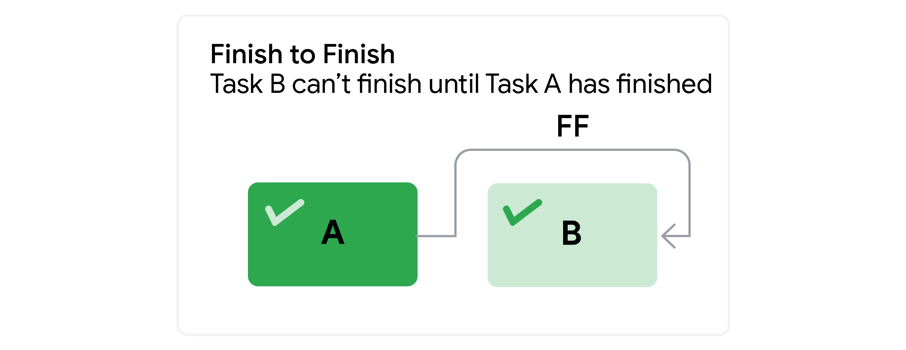
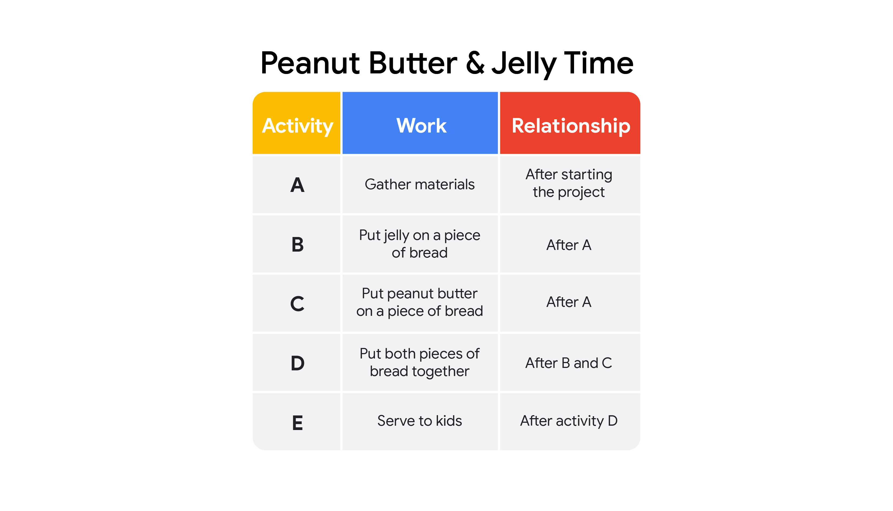

# Visualizing dependency relationships
In the video, you learned to identify several types of risks. In this reading, we will be discussing the different types of dependencies that can play a critical role in our project’s success. 

## Types of dependencies  
__Dependencies__ are a relationship between two project tasks in which the completion or the initiation of one is reliant on the completion or initiation of the other. Let’s explore four common types of dependencies:

### Finish to Start (FS)
In this type of relationship between two tasks, Task A must be completed before Task B can start. This is the most common dependency in project management. It follows the natural progression from one task to another.

Example: Imagine you are getting ready to have some friends over for dinner. You can’t start putting on your shoes (Task B) until you’ve finished putting on your socks (Task A). 

Task A: Finish putting on your socks. →Task B: Start putting on your shoes.

### Finish to Finish (FF)
In this model, Task A must finish before Task B can finish. (This type of dependency is not common.)

Example: Earlier in the day, you baked a cake. You can’t finish decorating the cake (Task B) until you finish making the icing (Task A).

Task A: Finish making the icing. →Task B: Finish decorating the cake.

### Start to Start (SS)
In this model, Task A can’t begin until Task B begins. This means Tasks A and B start at the same time and run in parallel.

Example:  You need to take the train home after work. You can’t get on the train (Task B) until you pay for the train ride (Task A).  

Task A: Start by paying for your train ride. →Task B: Start going home by boarding the train.

### Start to Finish (SF)
In this model, Task A must begin before Task B can be completed. 

Example:   One of your friends calls to tell you he’ll be late. He can’t finish his shift (Task B) and leave work until his coworker arrives to start her shift (Task A). 

Task A: Your friend’s coworker starts her shift. →Task B: Your friend finishes his shift.

## Dependency graphs
As a project manager, you will use these dependencies to visually represent the flow of work during your project. Let’s examine how to use a dependency graph with an everyday example.

Imagine you are making peanut butter and jelly sandwiches for the kids who will be coming to your dinner, and you want to use dependency relationships to map your activities on a graph.  

Let’s break each task down to create your dependency graph:

1. When you start your sandwiches, you need to gather your materials: bread, knife, jelly, peanut butter, plates, and napkins (Task A). 

2. At this point, you can put jelly on one piece of bread (Task B) and peanut butter on the other piece of bread (Task C).

3. Now you need to put both pieces of bread together (Task D).

4. Finally, you can put the sandwich on a plate and serve it (Task E).

## Key takeaways
There are four types of task dependencies:

* Finish to Start
* Finish to Finish
* Start to Start
* Start to Finish

A dependency graph can help you visualize these different dependencies and the flow of the work that needs to be done on a project. They can also help you identify any risk associated with them. 

[Back to Project Planning contents](./c3-Project-Planning.md)