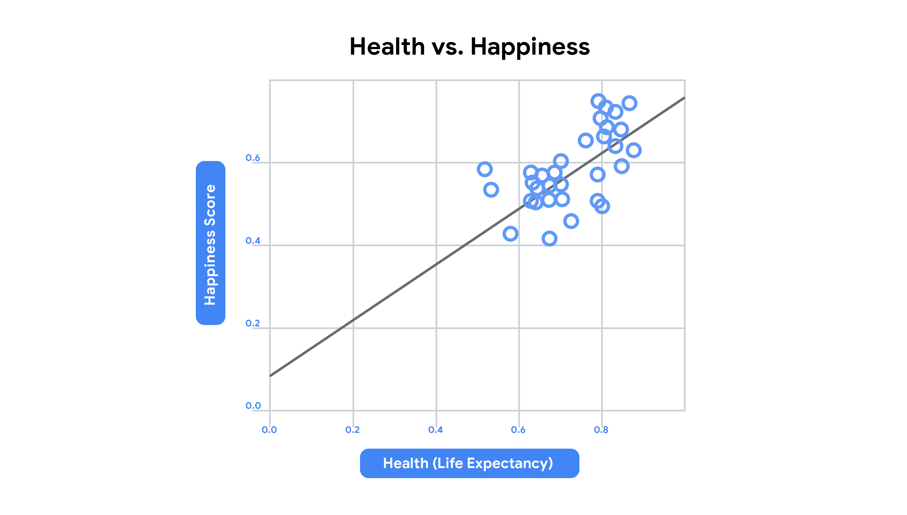
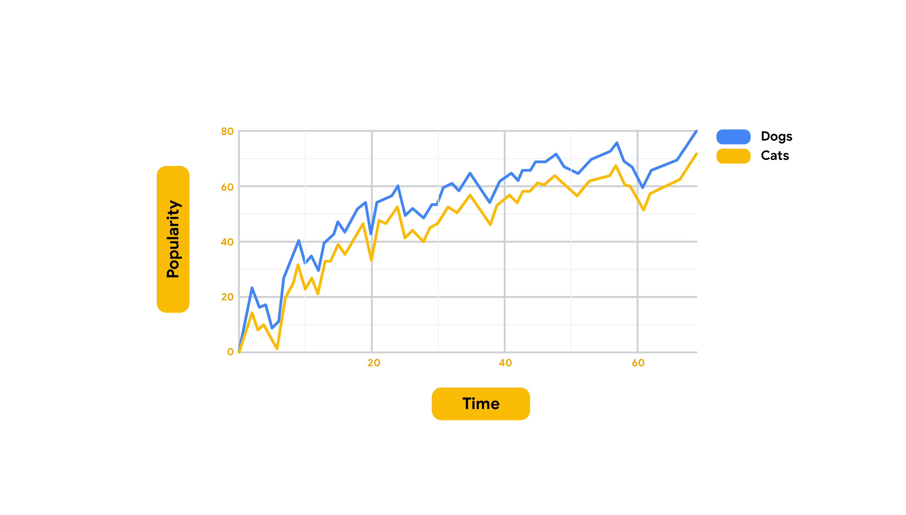

# Different ways to visualize data
Earlier, we discussed best practices for collecting and analyzing data. When it is time to present your data to your audience, you don’t just want to tell them about your findings and what they mean, you want to show them. __Data visualization__ helps us organize data and turn it into information that is clear and easy for our audience to digest.

In this reading, we will go over a variety of charts and graphs you can use to visually represent data. 

## Visualizing your data
Before translating your data into a chart or graph, you should be clear on what you want to show your audience. Figure out what data you want to use and why. You might want to __inform__ your audience about a new trend or a valuable piece of information, or __show relationships__ between data sets. Or maybe you need to __compare values__, understand the __composition__ of something, or __analyze trends and behaviors over set periods of time.__ 

The type of data you have, and the information you want to show or understand, will help you figure out the right data visualization to use. Let's go over some scenarios and discuss which charts and graphs would be best for each.  

## Show relationships
A __scatter plot__, sometimes referred to as a scatter chart or scatter graph, uses dots to represent values for two different variables. The position of each dot on the horizontal and vertical axis indicates values for an individual data point. Scatter plots will sometimes have a line drawn across its center. This line is known as the trend line and highlights the direction the points are trending towards. 

Scatter plots show the relationship between data sets, and can help us understand the impact of one factor on another. For example, the scatterplot below shows the relationship between the life expectancy of people living in a country and how happy those people are. The first variable, the happiness score, is reflected on the vertical axis —also called the __y-axis__. The second variable, life expectancy, is on the horizontal axis —also called the __x-axis__. By looking at this scatterplot, we can tell that as a person’s happiness score increases, so does their life expectancy. 

Scatter plot best practices: 
* Start the y-axis at 0 to represent data accurately.

## Comparing values
__Bar graphs__ use size contrast to compare two or more values. In the example below, the time of day is compared to someone’s level of motivation throughout the whole work day. By comparing this data, we can tell that this person’s motivation is low at the beginning of the work day, and gets higher and higher by the end. Bar graphs are also a great way to clarify trends and identify patterns. 

Bar graph best practices:
* Use consistent colors throughout the chart

* Use accent colors to highlight important data points or changes over time

* Use horizontal labels so it is easier to read 

## Demonstrating composition 
Now let’s check out another visualization you will probably recognize—the __pie chart__. Pie charts show us the __composition__ of something. In other words, how much each part of something makes up the whole. The pie chart below shows us all the activities that make up someone’s day. Half of it is spent working, which is shown by the amount of space that the blue section takes up. From a quick glance at this pie chart, you can easily tell which activities make up a good chunk of the day and which ones take up less time.

Pie chart best practices: 
* Avoid including too many categories so it is easy to compare slices

* Make sure that the slice values add up to 100%

* Order slices according to their size

## Analyzing trends and behaviors  
Tracking trends can help us understand shifts or changes in our data. __Line graphs__ are a great tool for visually showing change over time, but they can be paired with other factors, too. In the line graph below, we are using two lines to compare the popularity of cats and dogs over a period of time. Because the graph is using two different line colors, we can instantly tell that dogs are more popular than cats. We will talk more about using colors and patterns to make visualizations more accessible to audiences later, too. Even as the lines move up and down, there is a general trend upwards, and the line for dogs always stays higher than the line for cats.

Line graph best practices:
* To avoid clutter, don't show more than four categories.

* Organize highly variable data at the top of the chart to make it easy to read

__Scatterplots, bar graphs, pie charts, and line graphs__ are common data visualizations you will use throughout your career as a project manager.

[Back](./c4-Project-Execution.md)

