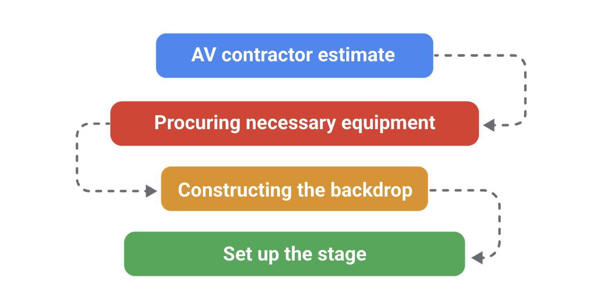

# Tips for defining project tasks
The process of identifying project tasks and defining them is one that requires practice. Breaking tasks down into workable parts is challenging because you have to decide which tasks may require additional subtasks and which tasks do not. For instance, if you are managing a cross-country move, you do not need to break down the task of unloading boxes from the car into which box should be moved first. However, you may need to break down the movers’ tasks into smaller, more detailed steps. As you progress in your career, you will get better at breaking tasks down. In the interim, here are some guidelines to help you improve this very important project management skill. 

## Define project tasks in one or two sentences
When writing descriptions of project tasks, keep them to one or two sentences long. If you find that a certain task description needs to be longer than one or two sentences, this indicates that the task is complex and could be broken down into smaller tasks or that it may need further clarification.

## Look at project task dependencies
When looking at how you might break certain parts of the project down into tasks, consider task dependencies, or what has to be completed or handed off from one person to another before work on each task can begin. Identifying dependencies can help you decide how much a task needs to be broken down. For instance, if you are managing a project that includes an awards ceremony and one of the tasks is to set up the stage, the dependencies for this task could include getting estimates from an audiovisual (AV) contractor, procuring necessary equipment, and constructing the stage backdrop.

# Enlist help from team members
It is often helpful for your team to be involved in the task breakdown process. You might have a meeting where you discuss each broad goal or major task with the team. This way, team members can present varying perspectives as they work together to break down tasks. For example, if someone on your team has had experience on a similar project, they may suggest a certain task actually be broken down into three different tasks. 

# Define project tasks by the amount of time they will take to complete
Defining project tasks by the amount of time they’re expected to take will reveal any especially lengthy tasks. If a task is expected to take a long time, it could indicate that there are additional subtasks that need to be defined. Identifying tasks by time is helpful for scheduling other tasks or events around the longer tasks. This strategy also helps you determine appropriate milestones, as milestones are often the culmination of a series of tasks. Acknowledging the completion of a large and lengthy task is also a great way to celebrate success, learn from the process, and keep the project on track.

# Identify project tasks by their “done” factors
Begin with the end in mind: What does it mean for the task to be considered “done”? From there, you can work backwards to see if you’ve missed any steps and identify checkpoints for completion along the way. 