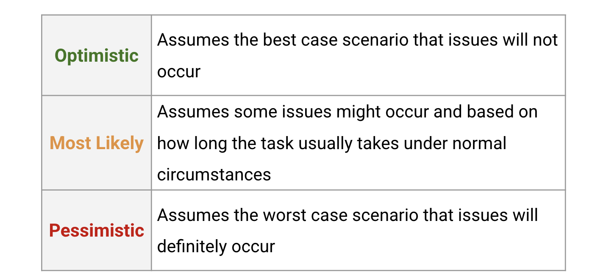

# The three-point estimating technique
Estimating is a crucial aspect of project management. Project managers are expected to accurately estimate essential elements of the project, such as costs, scope, and time. There are many different estimation techniques that can be used, depending on what aspect of the project needs an estimate. Estimation techniques allow project managers to provide better forecasts to stakeholders and clients and more accurately budget the funds and resources they need for project success. 

The three-point estimating technique can be used to help determine the most realistic time estimate for a task. It uses **optimistic, pessimistic, and most likely** calculations, meaning calculations are based on the “best case” (optimistic), “worst case” (pessimistic), and most probable scenarios. 

## Three-point estimation
In this technique, each task receives three estimates: optimistic, most likely, and pessimistic. Each of these three estimates is then associated with the corresponding amount of time that task is expected to take.

## The three-point estimating process
For each task, add a duration estimate in each category: optimistic, most likely, and pessimistic. You can get these estimates by doing research on the task or by asking a task expert. As a best practice, add notes about the conditions that determine each estimate.

## Determining a final estimate
To determine your final estimate—the estimate you’re going to use in your project plan—examine the optimistic and pessimistic timing, then compare it with the most likely timing. Consider the conditions that are likely to exist while the task is being completed. Does it seem reasonable that the most likely time can be met? If your team has never completed this task before, or if dependencies for the task are unknown, then the final estimate should be closer to the pessimistic estimate. If your team is familiar with the task and you’re able to confirm the conditions for an optimistic estimate, then the final estimate can be closer to the optimistic estimate. Alternatively, simply use the most likely estimate, especially if the difference between the optimistic and pessimistic estimates is minimal (a few hours or no more than one or two days). A good practice is to build in a “buffer” that accounts for risks that are likely but still keeps the project progressing at an efficient rate.

## Three-point estimation formulas
Some projects will require you to calculate specific numeric values for task time estimates. There are many online resources that provide more instruction for how to calculate estimates, but we’ve provided two popular formulas: the Triangular Distribution and the Beta (PERT) Distribution.

For each formula: E is Estimate (the final estimate you’ll assign to the task), o = optimistic estimate, p = pessimistic estimate, and m = most likely estimate.

## The Triangular Distribution
The weight of each estimate in this equation is identical, which means the most likely case does not affect the final estimate more than the optimistic or pessimistic estimates.

## The Beta (PERT) Distribution
The Beta (PERT) distribution is a weighted average. The most likely estimate receives a multiplier of four, while the overall divisor is increased to six. 

This method takes into account that the most likely case is more likely to occur, so it’s given more weight. The added weight is reflected in the multiplier of four.

Placing more weight on the most likely estimate increases the accuracy of the estimate. In most cases, the Beta (PERT) Distribution has been proven to be more accurate than three-point estimating and is often used to calculate both cost and time estimates.

