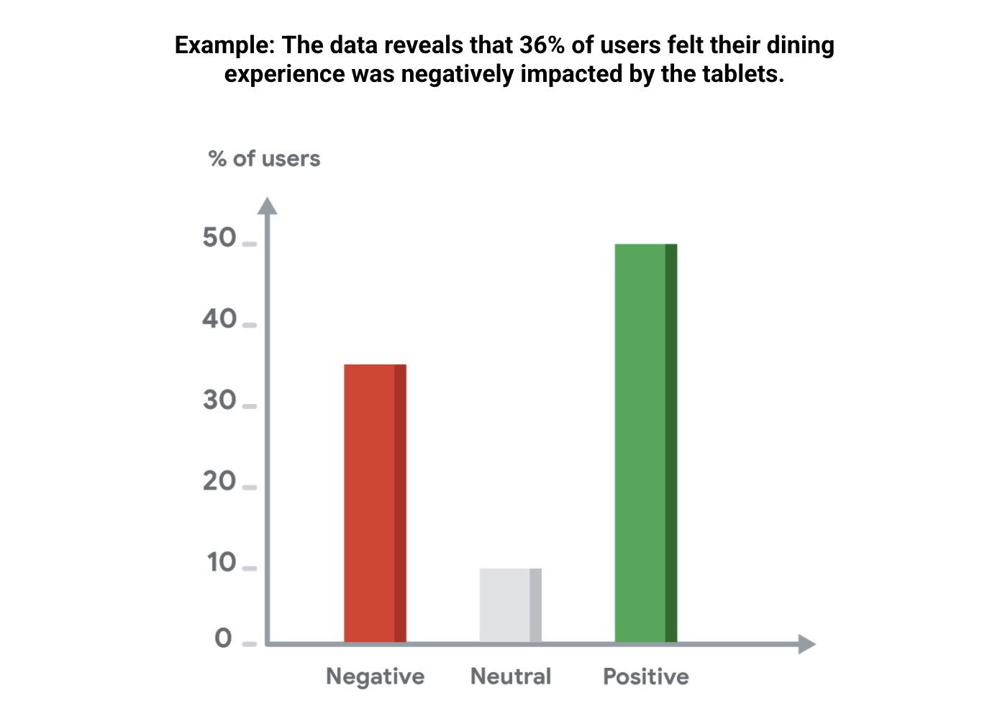

# Evaluation presentations: Components and tips
In a prior activity, you created survey questions for your evaluation. Once you've administered your survey and collected all the data for your evaluation, you'll have all the information you need to prepare an evaluation presentation. An evaluation presentation examines how well your project is working according to an identified set of standards. 

## What to include in your evaluation presentation
### **Introduction**
The introduction serves as a summary of your presentation and includes an overview of the project’s goals and desired outcomes. It should include a summary of your findings, lessons learned, and recommendations moving forward. This is a very important section of your presentation, but keep it brief. Your introduction should be no more than a paragraph and only include the most necessary information.  

### **What is being evaluated and why**
Here is where you will state the purpose of the evaluation. Remember, in the context of project quality management, the purpose of evaluation is to measure how well your project is meeting the established quality standards. Presenting evaluation findings to your stakeholders shows them how well the project is meeting quality standards and informs them of the project’s success. To do this:

* State the goal, milestone, or deliverable that is being evaluated and the quality standards that were defined for that aspect of the project.

* Include the evaluation questions and indicators that were used to evaluate each quality standard. 

**Pro tip:** Remember, your stakeholders have limited time. When preparing your presentation, only select the most important standards and questions.	 

### **Evaluation findings**
Now it’s time to state your findings. Give each standard its own section within this portion of the presentation, and summarize what the findings mean for each standard. Make a clear judgement about the findings: What did you learn? What can you take away from the data? Tell the story of what the data means for the future of the project and for the stakeholders.

* Example: "The data reveals that 36% of users felt their dining experience was negatively impacted by the tablets." It’s up to you to synthesize that data and determine why that might be. Maybe it’s because the tablet software wasn’t installed properly, resulting in glitchy technology. Or maybe it’s because the staff wasn’t trained effectively, and therefore the ordering process was seriously delayed. Maybe some customers just don’t want tablets taking their orders, and they prefer to deal with wait staff. Explain what the data means in a way that allows stakeholders to make decisions or declare this aspect of the project successful or not.

**Pro tip:** Visualize the data with graphs or charts to quickly convey the message of the findings.

### **Conclusion with recommendations**
In your conclusion, state your findings again and propose a couple of recommendations for how to apply the findings to the next phase of the project. You can also outline how these findings may be used in future projects. 

## How to format your presentation 
Slide-based presentations can be created using digital applications like Google Slides or Microsoft PowerPoint. This type of presentation uses images and succinct bullet points to provide the necessary information to stakeholders. Slide-based presentations typically include summarized information rather than lengthy, in-depth paragraphs. They are great tools for high-level presentations, when your stakeholders do not need to know every single project detail. 

## Additional tips
Tailor communications to stakeholders: When it comes to communicating important milestones to stakeholders, consider whom you are presenting to. Tailor your presentation to your audience in a way that they will understand and enjoy.

* Start with an interesting hook: Begin your presentation with an ice breaker, joke, or an interesting visual aid to get your stakeholders’ attention right away. 

* Use visuals throughout your presentation: The use of visuals creates interest and keeps the audience engaged in your presentation. 

[Back](./c6-capstone.md)

