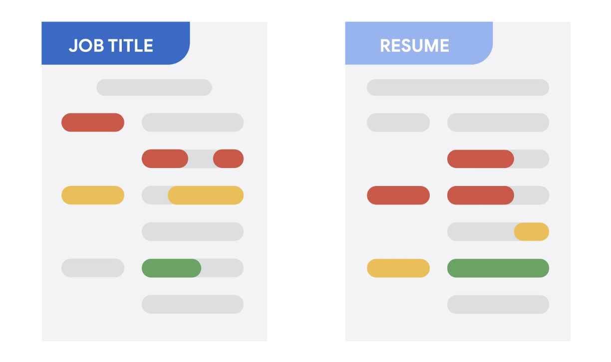
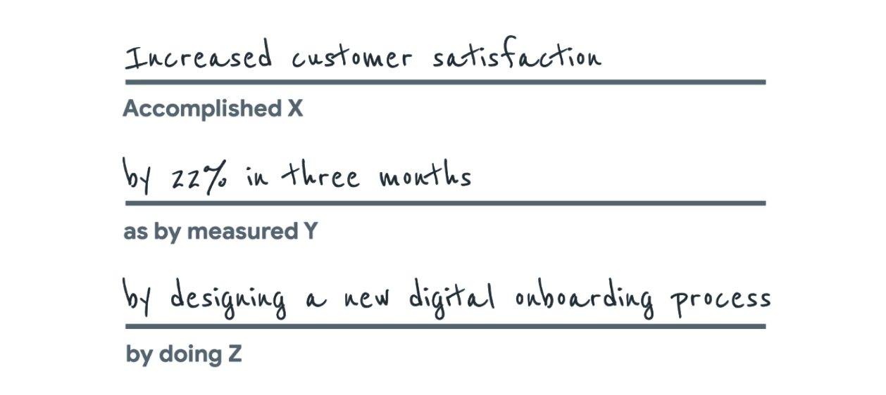
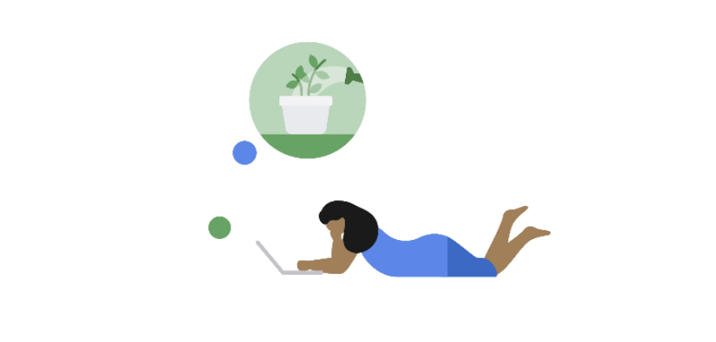

# Top tips for interview success
You just heard from Googlers on their top tips to help you prepare for an interview. Read on for four final preparation tips to help set you up for interviewing success:

## 1. Find connections between the job listing and your resume.
First, re-read your resume and the job description to help you draw lines between the two. Where do they connect? Then, as you interview, include specific keywords or phrases from the job description that match skills you possess or achievements you have accomplished previously in your career. 

## 2.Focus on Data

As you start to think about things you want to highlight in your interview, don’t forget to include data. This helps your interviewer understand not just your overall achievements, but how big of an impact you made. What data can you provide that tells the story of your experience as it relates to the position? The “equation” we suggest using to convey this information goes something like this: I accomplished X as measured by Y doing Z. Here’s an example: “I increased customer satisfaction by 22% in three months by designing a new digital onboarding process.”

If you don’t have access to this kind of data from a previous position, you can still indicate the scope you were accountable for and strengthen the language you use when describing your responsibilities by including action words like provided, created, developed, supported, implemented, and generated. For example: “I implemented a new scheduling system that led to the team meeting 95% of their deadlines.”

## 3. Look back at past work experiences.
Review your work history. That may not sound like something you need to prepare for, but most of us have done more than we think. It’s easy to forget some of our own wins—and lessons learned from mistakes.    

Think of examples of times you achieved something so you are prepared to answer questions like “Tell me about a time when . . .” or “How would you approach this situation . . .?" 

## 4. Come ready with questions.
Come to the interview with your own questions, such as “What are some upcoming projects I’d be working on? What current goals is the company focused on? Can you tell me about the team I’ll be working with?” This not only shows you care about understanding the company and the position you’re applying for, but it’s also a testament to the research you’ve done by looking into the company. Besides, this is your opportunity to interview them as well. 

This type of preparation will help you feel confident and prepared to talk about yourself, your experience, your career aspirations, and the position on your interview.