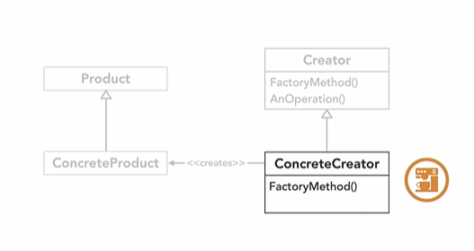
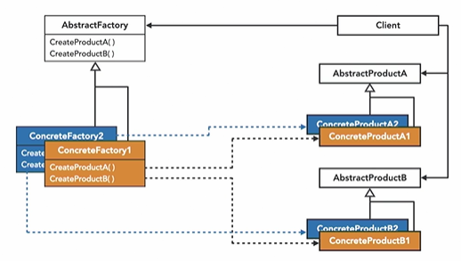
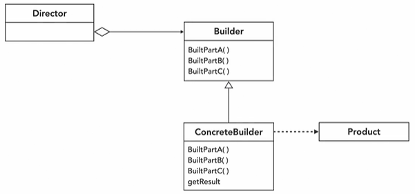
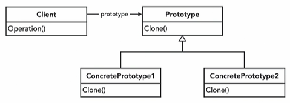
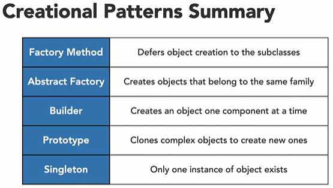

## Patterns to start learning recommended by big 4

+ [x] Abstract factory
+ [ ] Adapter
+ [ ] Composite
+ [ ] Decorator
+ [x] Factory
+ [x] Observer
+ [x] Strategy
+ [ ] Template

# Creational Design Patterns
good software must be 
+ Flexible 
+ Maintainable
+ Extendable

creational patterns focus on object instantiation
+ The **goal** of creational patterns is to efficiently create objects to increase flexibility

## Factory Method
+ one of the most used design patterns
+ Encapsulates the creation of related objects
+ Provides and interface to create an object but defers the creation to the sub classes
+ create object based on runtime parameters
+ Do not need to know which objects you will need to create
+ Lets the subclasses instantiate the object instead of the main program
+ easy to add new products or change existing ones
+ no need to make changes throughout the code base

eg: coffee machine  
+ espresso
+ Cappuccino

## Abstract Factory Method
+ Provides an interface for creating families of related objects without specifying their concrete classes
+ Abstract factories keep families of objects together

[Code Showing Abstract factory](./code/code-abstact-factory.md)

eg: car factories  
+ gas cars
+ electric cars

## Builder
+ Separates construction of complex objects
+ Builds a complex object one step at a time
+ Same construction process for different representations
+ The builder design **encapsulates** the build
+ Builders share the same steps to build an object

[Code describing builder pattern](./code/code-builder.md)

## Prototype
+ Creates new objects by cloning or copying an existing one
+ is it better to perform shallow or deep copy

## Singleton
+ constructor is private
+ static getInstance() creates an object
+ globally available only one instance exists

# Structural 
class hierarchies and relationships  

# Behavioral Design Patterns
Object Intercommunication
## Chain of responsibility pattern

+ Represents sequential checks as chain of handlers
+ Each handler handles the situation or passes on the responsibility to the next handler

eg: validation of strings 
+ Name
+ email
+ password

## Command Pattern

+ Use this pattern to reduce coupling between classes that call one another and make functionality more reusable between similar classes
+ Represent events or changes that can occur in our program as their own classes which implement a common command interface

eg: drawing application

## Observer Pattern

+ When your program has a lot of different events that different object need to react to. in other words, when we only want objects that care about certain events to be notified of their occurrence
+ Write our programs in terms of publishers and subscribers, where publishers simply publish events and subscribers can choose whether or not to listen
subscribers

eg : chat application  

## Strategy pattern

+ When our program needs a clean maintainable way to choose between different ways of doing things on the fly
+ Represent search of the different ways of doing something as its own strategy class which encapsulates the corresponding logic.

